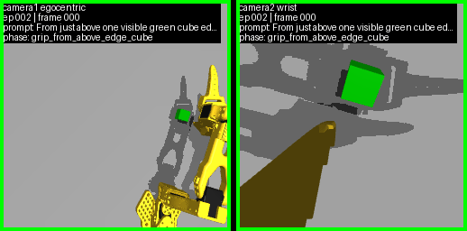
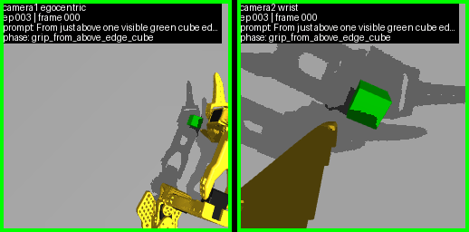

# physical_ai_agent

Mac-local and RunPod-ready physical AI evaluation stack for SO101/SmolVLA,
MuJoCo/LIBERO experiments, and agentic closed-loop evaluation.

The repository has grown past the initial scaffold. The current implementation
focuses on three connected lanes:

- SO101 simulation, dataset generation, SmolVLA fine-tuning, TensorBoard
  validation, and closed-loop rollouts.
- Agentic wrappers around lightweight VLA policies, including planner,
  verifier, retry, and loop-test analysis tools.
- Real SO-100/SO-101-adjacent safety and observation tooling, kept separate
  from simulation-only commands.

For active project state, read [Summary.md](Summary.md). For collaboration and
safety rules, read [AGENTS.md](AGENTS.md).

## Screenshots / Visual Evidence

The repository keeps reviewable SO101 rollout media under `docs/research/`.
These examples use the TensorBoard-style side-by-side policy-input rendering
contract.





## Quick Start

Use Python 3.11+.

```bash
python -m venv .venv
source .venv/bin/activate
pip install -e ".[dev,sim,so101,web,ml]"
```

For SmolVLA/LeRobot work:

```bash
pip install -e ".[smolvla]"
```

For ManiSkill work:

```bash
pip install -e ".[maniskill]"
```

Standard test commands:

```bash
PYTHONPATH=src .venv/bin/python -m unittest discover -s tests
PYTHONPATH=src .venv/bin/python scripts/validate_so101_training_configs.py
git diff --check
```

No-dependency syntax fallback:

```bash
PYTHONPATH=src python3 -B -c "import ast, pathlib; files=list(pathlib.Path('src').rglob('*.py'))+list(pathlib.Path('tests').rglob('*.py')); [ast.parse(p.read_text()) for p in files]; print(f'parsed {len(files)} files')"
```

## Repository Map

```text
src/physical_ai_agent/       Core library: policies, env wrappers, sim, eval, schemas.
scripts/                     Executable training, dataset, viewer, analyzer, and checkpoint tools.
configs/so101/training/      User-facing SO101 training configs.
configs/so101/hydra/         Hydra launcher entrypoints for canonical training runs.
configs/so101/training_datasets/
                             Dataset contracts, export recipes, and checksums.
configs/agent/               Qwen/SO101 tool plans and planner config.
docs/                        Research notes, training standards, harness specs, checkpoint ledger.
papers/                      RSS SemRob paper workspace.
experiments/                 Isolated experiment notes and requirements.
tests/                       Unit/regression tests for contracts and tooling.
_workspace/                  Local generated artifacts, datasets, checkpoints, TensorBoard logs.
```

Do not commit `_workspace/` artifacts, datasets, TensorBoard event files, or
model checkpoints.

## SO101 Training Lane

The canonical launcher is:

```bash
PYTHONPATH=src .venv/bin/python scripts/start_so101_training.py start \
  --hydra-config training/grip_the_cube_v2
```

Inspect the active run:

```bash
PYTHONPATH=src .venv/bin/python scripts/start_so101_training.py status --json
```

The launcher enforces the current SO101 training contract:

- Hydra/Pydantic config-first launch flow.
- One training process and one TensorBoard process by default.
- TensorBoard uses multifile reload because training and loop-test writers can
  append separate event files in the same run logdir.
- Checkpoint, validation, and closed-loop cadence are aligned.
- Training-time closed-loop tests are called from the training process, not by
  an external polling monitor.
- Camera contract is `camera1=egocentric_cam`, `camera2=wrist_cam`.
- SO101 image inputs are kept at the configured SmolVLA-compatible resolution.
- Training uses grid-bin balanced sampling when the dataset provides camera1
  object-position sidecar metadata.

Validate training configs before launch:

```bash
PYTHONPATH=src .venv/bin/python scripts/validate_so101_training_configs.py
```

See:

- [docs/so101_local_training_standard.md](docs/so101_local_training_standard.md)
- [docs/so101_smolvla_training_pipeline.md](docs/so101_smolvla_training_pipeline.md)
- [configs/so101/training/README.md](configs/so101/training/README.md)

## Experiment Manager

The current web UI is the SO101 Experiment Manager. It combines dataset viewing,
closed-loop case inspection, training run metadata, loop-test analysis, and
interactive simulator surfaces.

```bash
PYTHONPATH=src .venv/bin/python scripts/serve_so101_dataset_viewer.py \
  --host 0.0.0.0 \
  --port 8768
```

Open:

```text
http://127.0.0.1:8768/
```

For same-Wi-Fi mobile access, use the Mac LAN IP with the same port.

Related analyzer/export tools:

```bash
PYTHONPATH=src .venv/bin/python scripts/build_loop_test_analyzer_export.py --help
PYTHONPATH=src .venv/bin/python scripts/serve_loop_test_analyzer.py --help
```

## Dataset Tooling

SO101 dataset generation and management is script-driven. Important entrypoints:

```bash
PYTHONPATH=src .venv/bin/python scripts/export_so101_training_datasets.py --help
PYTHONPATH=src .venv/bin/python scripts/export_so101_teacher_rollouts_lerobot.py --help
PYTHONPATH=src .venv/bin/python scripts/export_so101_pickplace_teacher_rollouts_lerobot.py --help
PYTHONPATH=src .venv/bin/python scripts/build_so101_camera_grid_bins.py --help
PYTHONPATH=src .venv/bin/python scripts/build_so101_predecoded_image_cache.py --help
PYTHONPATH=src .venv/bin/python scripts/write_so101_dataset_checksums.py --help
```

Dataset contracts live under:

```text
configs/so101/training_datasets/
```

Training configs reference datasets from:

```text
configs/so101/training/
```

Keep dataset-generation metadata and training-run configs separate.

## Closed-Loop Evaluation

Training-time loop tests are run by the training process through:

```bash
PYTHONPATH=src .venv/bin/python scripts/run_so101_training_loop_test.py --help
```

Standalone SO101 policy evaluators include:

```bash
PYTHONPATH=src .venv/bin/python scripts/evaluate_so101_picklift_smolvla_policy.py --help
PYTHONPATH=src .venv/bin/python scripts/run_so101_qwen_closed_loop_eval.py --help
PYTHONPATH=src .venv/bin/python scripts/run_so101_qwen_smolvla_e2e.py --help
```

Expected TensorBoard evidence for training-result loop tests includes rollout
media and RMSE diagnostics. Static scalar-only loop-test output is not enough
for review.

## Live SO101 Simulation

Native MuJoCo viewer:

```bash
sh scripts/view_so101_live.sh
```

Viewer with policy input cameras:

```bash
sh scripts/view_so101_live.sh --show-inputs --fps 15
```

Browser-only live simulator with SmolVLA inference:

```bash
sh scripts/view_so101_live.sh \
  --browser-only \
  --policy smolvla \
  --allow-download \
  --smolvla-action-steps 15 \
  --show-inputs \
  --fps 2
```

Lightweight command-loop simulator:

```bash
sh scripts/so101_interactive_sim.sh
sh scripts/so101_interactive_sim.sh --gui --port 8766 --output-dir _workspace/so101_interactive/gui
```

Simulation artifacts are written under `_workspace/`.

## Visual RL and Visual Servo Experiments

Visual RL smoke:

```bash
PYTHONPATH=src .venv/bin/python scripts/so101_visual_rl_smoke.py \
  --env-id MuJoCoPickLift-v1 \
  --camera-name wrist_cam \
  --width 128 \
  --height 128 \
  --steps 4
```

Visual policy smoke:

```bash
PYTHONPATH=src .venv/bin/python scripts/so101_visual_rl_policy_smoke.py \
  --env-id MuJoCoPickLift-v1 \
  --camera-name wrist_cam \
  --width 64 \
  --height 64 \
  --rollout-steps 4
```

Other experimental training entrypoints include:

```bash
PYTHONPATH=src .venv/bin/python scripts/train_so101_visual_rl.py --help
PYTHONPATH=src .venv/bin/python scripts/train_so101_wrist_ego_visual_servo.py --help
PYTHONPATH=src .venv/bin/python scripts/train_so101_lerobot_visual_bc.py --help
```

## Checkpoint Smoke Gates

The historical checkpoint gates are still available and useful for regression
checks:

```bash
sh scripts/checkpoint_01.sh
sh scripts/checkpoint_02_04.sh
sh scripts/checkpoint_05_06.sh
sh scripts/checkpoint_07_13.sh
sh scripts/checkpoint_14_15.sh --allow-download --require-3d-render --require-real-smolvla
sh scripts/checkpoint_16.sh
sh scripts/checkpoint_17.sh
sh scripts/checkpoint_18.sh
sh scripts/checkpoint_19.sh --allow-download --require-real-smolvla
sh scripts/checkpoint_20.sh
sh scripts/checkpoint_21.sh
sh scripts/checkpoint_22.sh
sh scripts/checkpoint_23.sh
sh scripts/checkpoint_24.sh --require-maniskill
```

See [docs/checkpoint_status.md](docs/checkpoint_status.md) for checkpoint
claim boundaries and evidence paths.

## RunPod

RunPod is used for heavier SmolVLA/LIBERO/SO101 training and evaluation. The
repo keeps setup and lifecycle helpers under `scripts/`:

```bash
RUNPOD_SSH='<pod-user>@ssh.runpod.io' sh scripts/runpod_check.sh
RUNPOD_API_KEY='<api-key>' RUNPOD_POD_ID='<pod-id>' sh scripts/runpod_pod.sh stop
```

Current policy: completed remote experiment datasets, results, and checkpoints
must be downloaded locally, verified, then removed from the remote artifact
directory. Do not leave old experiment output on remote storage by default.

## Real Robot Boundary

Real SO-100/SO-101-adjacent scripts live in `scripts/real_so100_*` and related
docs/skills. Treat them separately from simulation commands.

Before any real-hardware action, read the repo-local hardware contracts and use
read-only observation/proposal paths first. Simulation candidates are not
automatically safe to execute on hardware.

## Development Notes

- Use `rg` for repository search.
- Prefer config edits over ad hoc training flags.
- Keep generated datasets, checkpoints, TensorBoard event data, videos, and
  local experiment artifacts out of PRs.
- For README-level status, link to durable docs instead of copying large
  research logs into this file.
