# myCobot 320 M5 2022 Adaptive Gripper Validation Ladder

This note freezes the validation order for the myCobot 320 M5 2022 adaptive
gripper POC. The goal is to avoid random MuJoCo coordinate tuning. Each step
must produce evidence before the next step changes code.

## Scope

Target upstream source:

- ROS2 Humble robot model:
  `mycobot_description/urdf/mycobot_320_m5_2022/mycobot_320_m5_2022_adaptive_gripper.urdf`
- Arm meshes:
  `mycobot_description/urdf/mycobot_320_m5_2022/*.dae`
- Adaptive gripper meshes:
  `mycobot_description/urdf/pro_adaptive_gripper/*.dae`

Known adjacent but non-target sources:

- ROS1 320 gripper:
  `mycobot_description/urdf/mycobot_320_m5_2022/new_mycobot_pro_320_m5_2022_gripper.urdf`
- ROS1 generic adaptive gripper:
  `mycobot_description/urdf/adaptive_gripper/mycobot_adaptive_gripper.urdf`

The ROS1 files are useful references, but they are not the primary source for
the 320 M5 2022 adaptive gripper profile.

## Ladder

### Gate 1: Source Routing

Question: are we importing the intended upstream files?

Pass evidence:

- The scene builder uses the ROS2 Humble 320 adaptive URDF.
- The generated MuJoCo XML references converted OBJ files for all seven arm
  links and all seven `pro_adaptive_gripper` links.
- The XML contains these mimic-linkage joints:
  `gripper_controller`,
  `gripper_base_to_gripper_left2`,
  `gripper_left3_to_gripper_left1`,
  `gripper_base_to_gripper_right3`,
  `gripper_base_to_gripper_right2`,
  `gripper_right3_to_gripper_right1`.

Current status: passed by XML structure check in PR #20. This does not prove
visual assembly or grasp physics.

### Gate 2: URDF Kinematic Tree Parity

Question: does the converted MuJoCo body tree match the upstream URDF tree?

Pass evidence:

- A script emits a parent-child table from the upstream URDF.
- The generated MuJoCo XML emits the corresponding body/joint table.
- The two tables match for every arm and gripper link, including fixed
  `joint6output_to_gripper_base`.
- Joint origin, axis, lower, upper, and mimic multiplier are compared numerically.

Stop condition:

- Do not tune collision pads, cube placement, friction, or arm trajectory if
  this table does not match.

Current status: passed by
`scripts/verify_mycobot_320_adaptive_kinematic_tree.py` against the ROS2 Humble
adaptive gripper source. Evidence: 13/13 arm and adaptive-gripper joints passed
parent-child, origin, axis, range, and mimic-multiplier comparison.

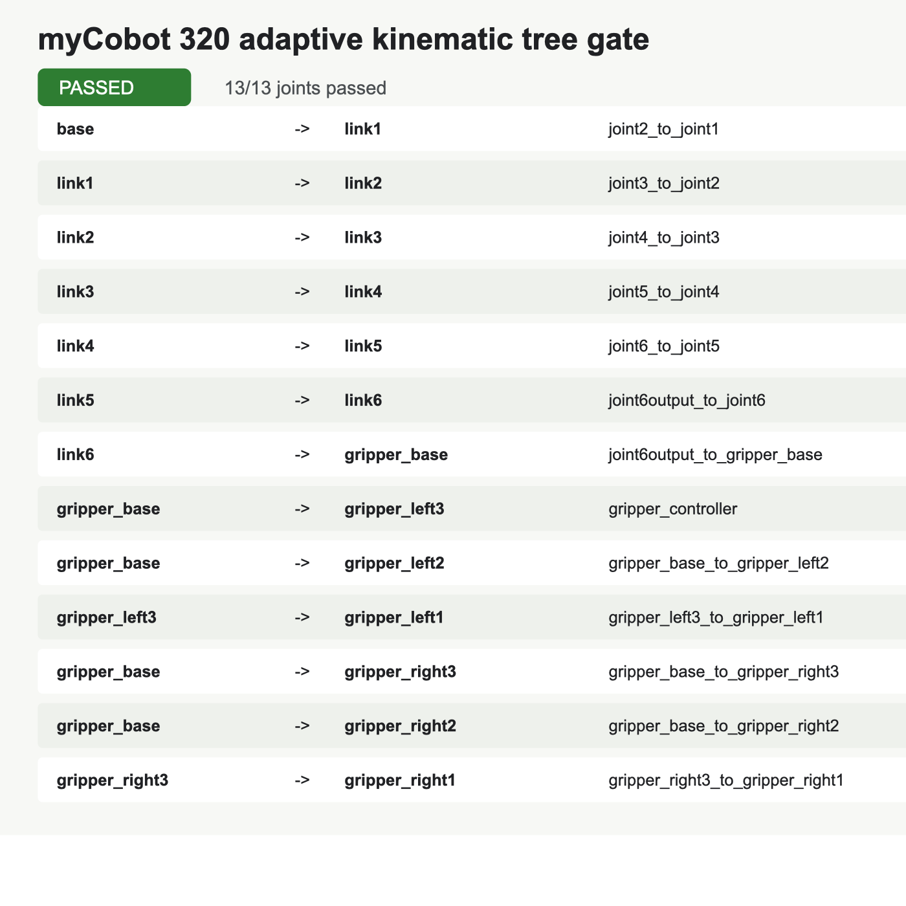

### Gate 3: Mesh Transform Parity

Question: are DAE geometry transforms and URDF visual origins applied exactly
once?

Pass evidence:

- For each link, record whether the OBJ conversion uses raw geometry vertices
  or baked `visual_scene` transforms.
- For the arm, raw geometry is currently required because baking DAE scene
  transforms and then applying URDF origins separated the arm parts.
- For the adaptive gripper, test raw-vs-baked conversion per mesh family and
  compare against a reference render before choosing.

Stop condition:

- Do not infer pad locations from a visually suspect mesh assembly.

Current status: passed by
`scripts/verify_mycobot_320_adaptive_mesh_transform.py` against the ROS2
Humble adaptive gripper source. Evidence: 14/14 arm and adaptive-gripper meshes
had identical raw-geometry and baked-visual-scene OBJ bounds
(`max_center_delta=0`, `max_span_delta=0`). The selected conversion mode remains
`raw_geometry`, and the mesh conversion path is not the current suspect for the
bad gripper assembly.

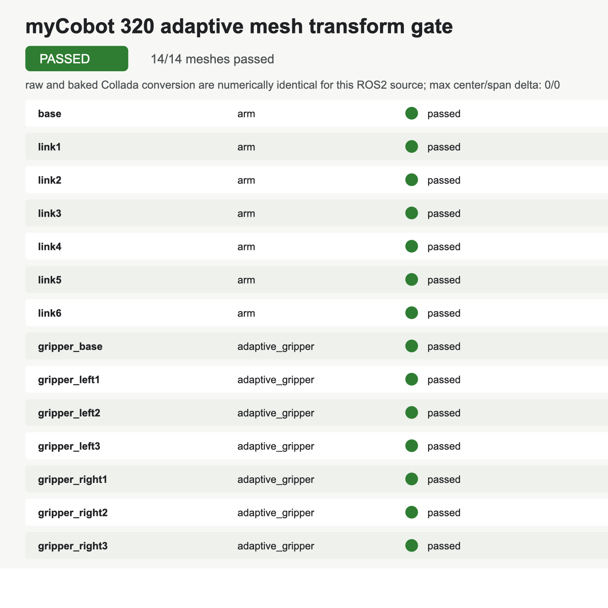

### Gate 4: Reference Visual Pose

Question: does zero pose look like the official model?

Pass evidence:

- Render the upstream ROS2 adaptive URDF in a reference tool first. Acceptable
  references are RViz, Gazebo, or an independently generated URDF kinematic
  renderer.
- Render the MuJoCo conversion from front, side, top, and wrist-close views.
- Compare link order and finger orientation against the reference. A screenshot
  alone is not enough if the view hides the finger linkage.

Stop condition:

- If the middle linkage looks flipped, floating, or disconnected, return to
  Gate 2 or Gate 3. Do not proceed to grasp.

Current status: passed as a source-pose parity check, then corrected after
human visual inspection. `scripts/verify_mycobot_320_adaptive_visual_pose.py`
confirmed 14/14 official links had identical upstream URDF zero-pose link
origins and generated MuJoCo XML visual centers (`max_link_origin_delta=0`,
`max_visual_center_delta=0`), but that was not sufficient to prove a physically
plausible render. The MuJoCo compiler now sets `eulerseq="XYZ"` so URDF/RViz
RPY poses are interpreted consistently; without it, the arm and gripper render
as visibly broken even though the numeric XML parity gate passes.

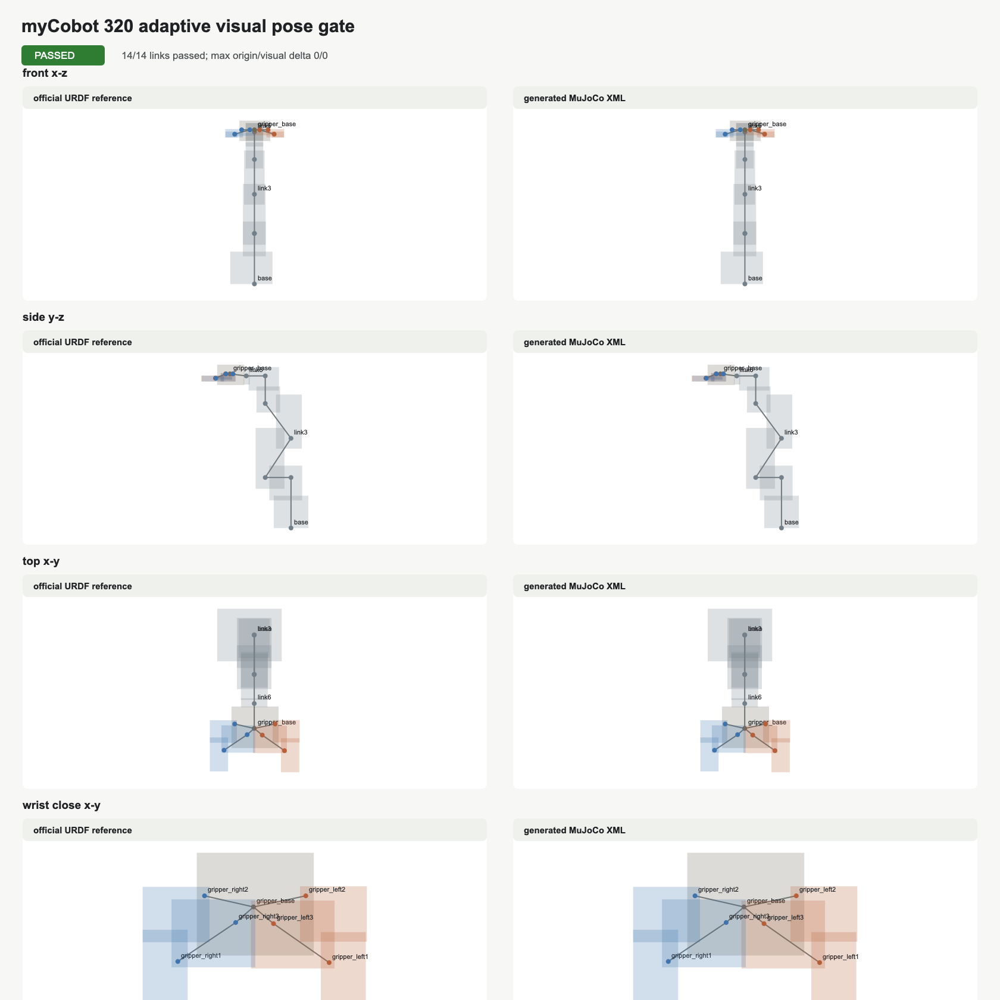

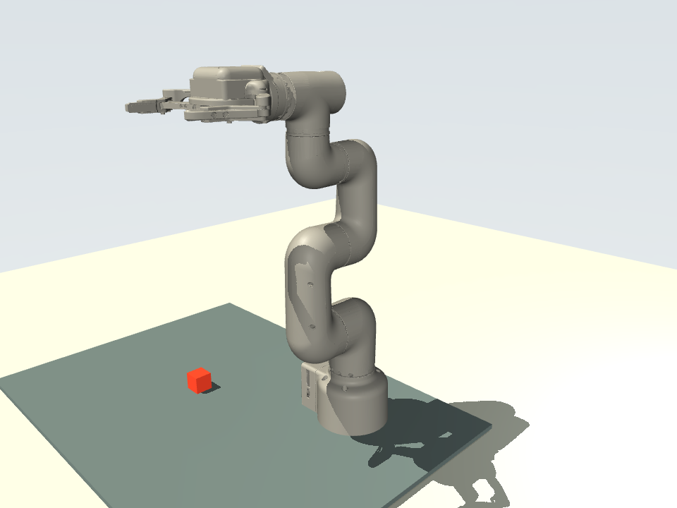
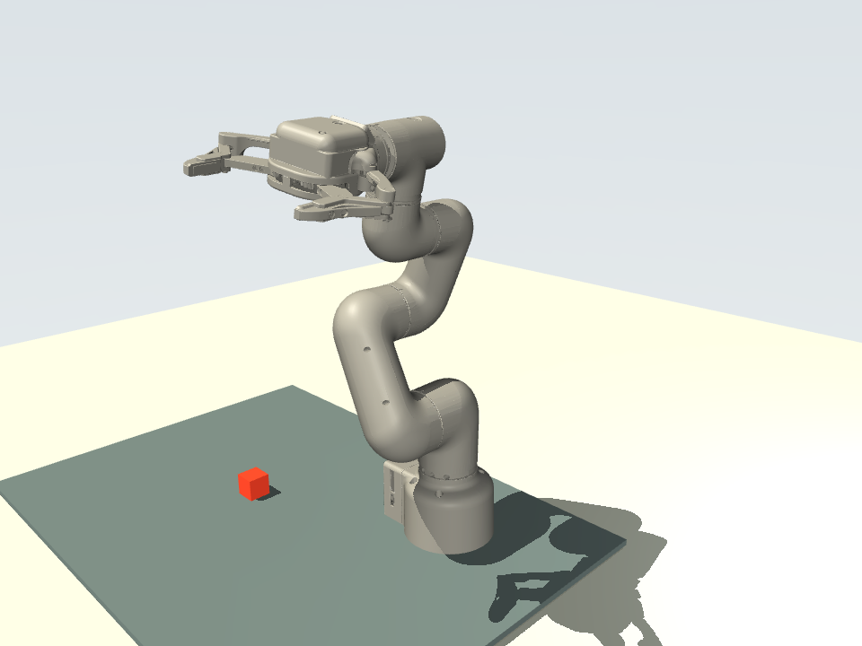
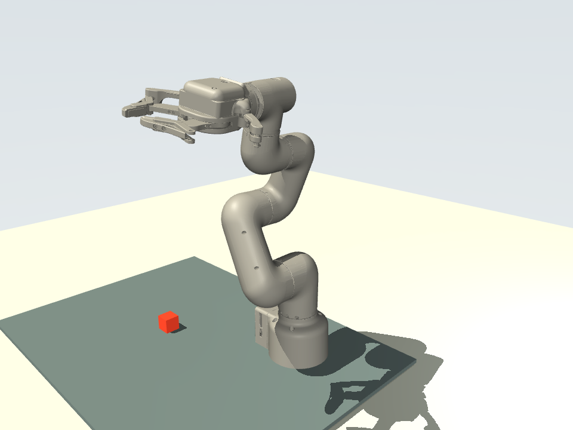

Follow-up correction: a direct MuJoCo closed-loop conversion was attempted and
then removed. The upstream URDF expresses the adaptive gripper as a mimic-joint
tree for ROS/RViz, while the real mechanism is a closed linkage. Adding
`equality/connect` loop constraints on top of the official mimic tree made the
visual links fight the generated MuJoCo constraints during closed commands; the
rendered gripper looked under-assembled, with intermediate links visibly pulled
apart. The POC now keeps the official mimic tree as the visual authority and
re-applies the kinematic mimic pose after each MuJoCo step. That preserves the
official assembly while the separate invisible finger-pad geoms provide the
contact proxy for cube experiments.

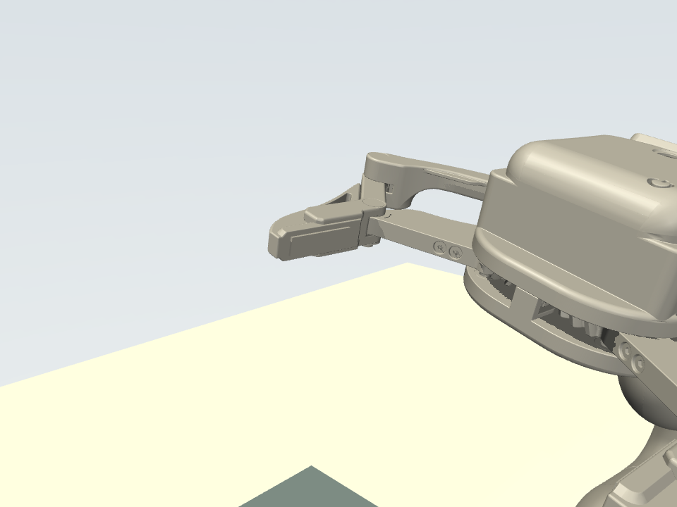
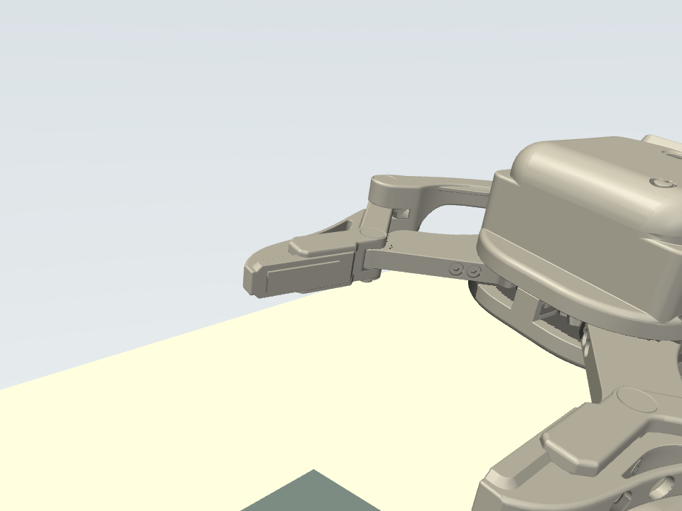
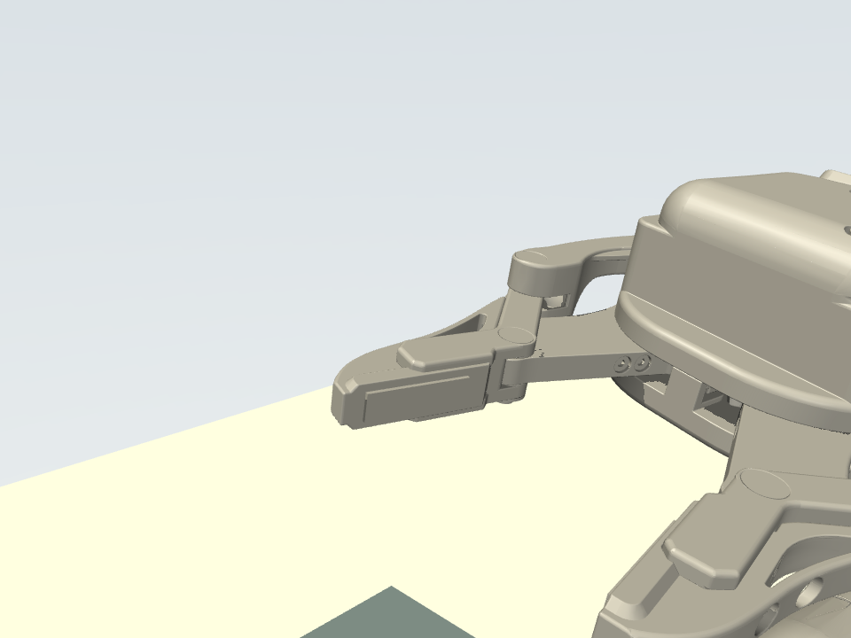
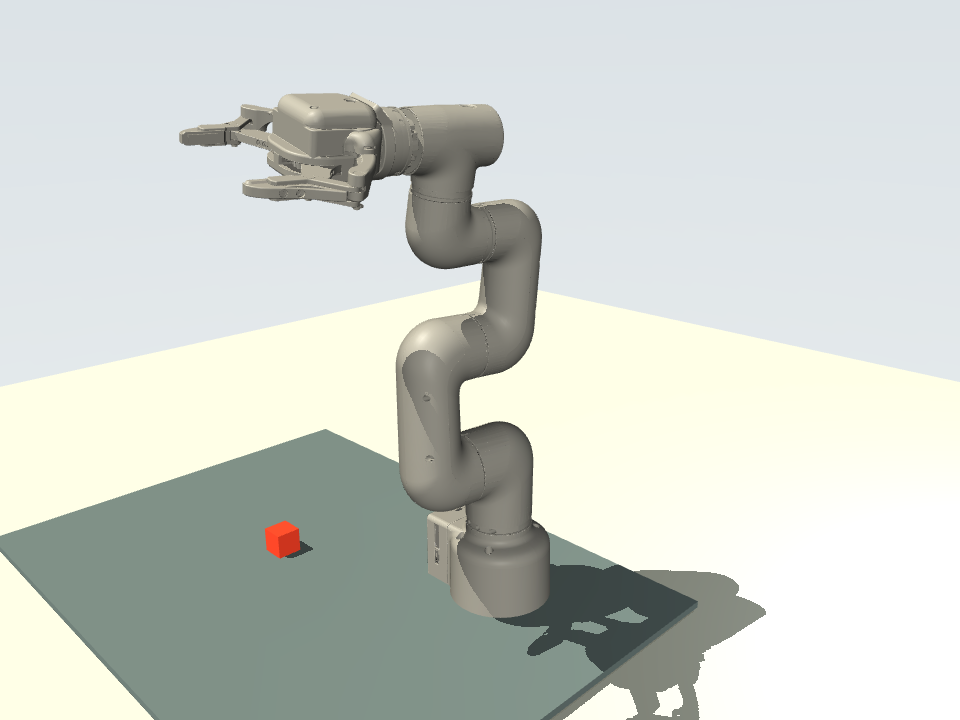

Second follow-up correction: the original contact pads were also in the wrong
coordinate frame. They used raw DAE mesh coordinates, but the MuJoCo bodies use
the official URDF visual origin transform first. The pads are now placed on the
closed-fingertip contact points in body-local coordinates:
`left_finger_pad=(0.00093, 0.04795, 0.00381)` and
`right_finger_pad=(-0.00567, 0.04202, 0.00390)`. The adaptive gripper mimic
followers are not clamped by their passive joint limits during kinematic pose
application because the official controller lower bound (`-1.11`) expands past
some follower limits. Clamping the followers left the jaw partially open and
made the closed pose look wrong. With the unclamped official mimic expression,
the closed gripper stays assembled after arm motion.

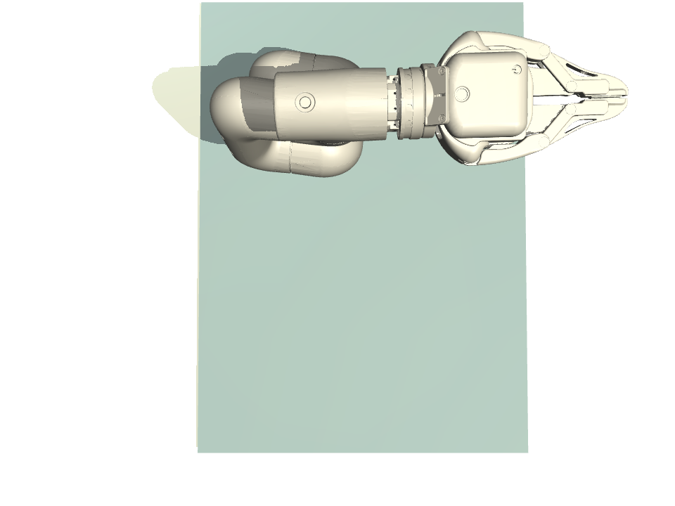
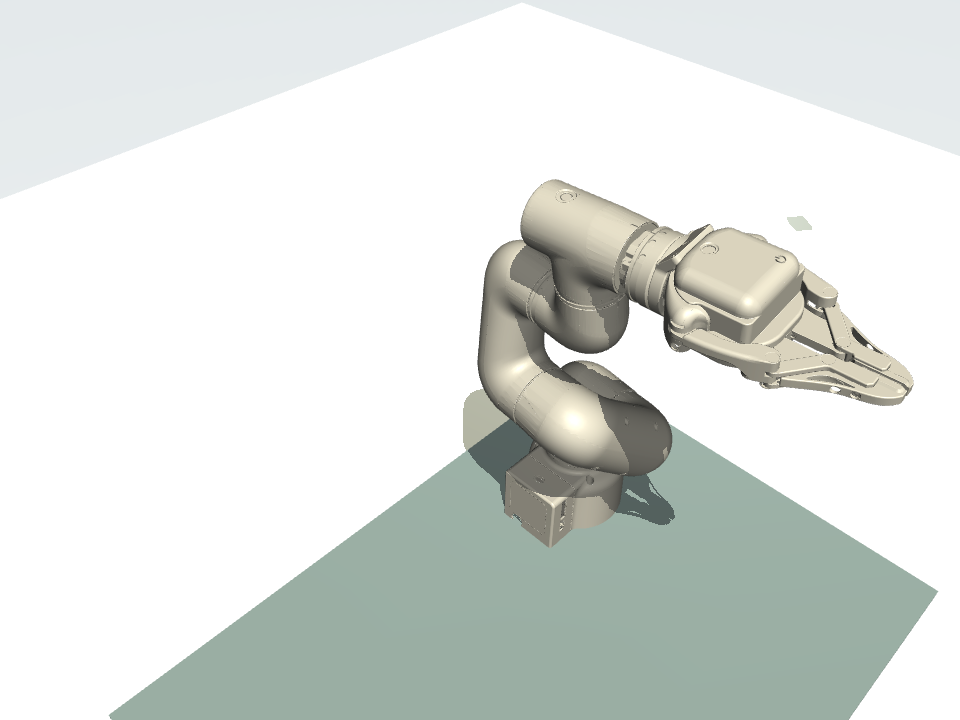
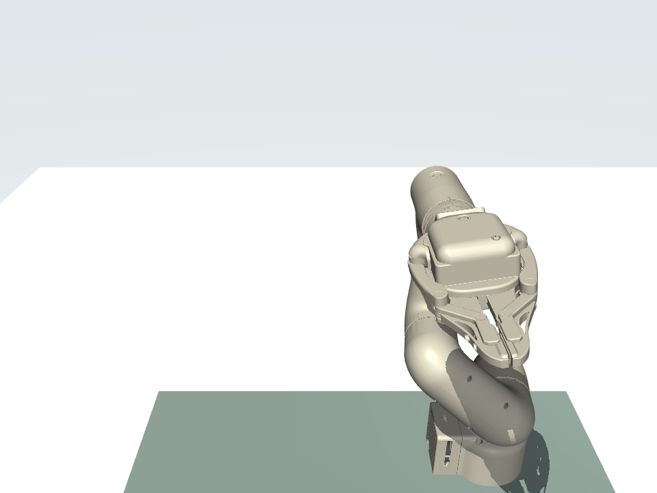

### Gate 5: Mimic Motion Parity

Question: does one gripper command move all adaptive gripper links in the
expected direction?

Pass evidence:

- Sample at least five `gripper_controller` values across the upstream range.
- For each sample, record follower joint values after mimic expansion.
- Render or export link poses for open, middle, and closed poses.
- The jaw gap must change monotonically in the intended close direction.

Stop condition:

- If closing increases the jaw gap, do not compensate with cube placement.
  Fix mimic mapping or command convention first.

Current status: passed by
`scripts/verify_mycobot_320_adaptive_mimic_motion.py` against the ROS2 Humble
adaptive gripper source. Evidence: five `gripper_controller` samples expanded
all official follower joints and showed that increasing controller value opens
the jaw. The upstream range lower end is closed (`-1.11`, jaw gap `0.0505 m`)
and the upper end is open (`0.0`, jaw gap `0.1510 m`). The MuJoCo command
convention was corrected so adaptive command `+1` maps to open `0.0`, and
adaptive command `-1` maps to closed `-1.11`.

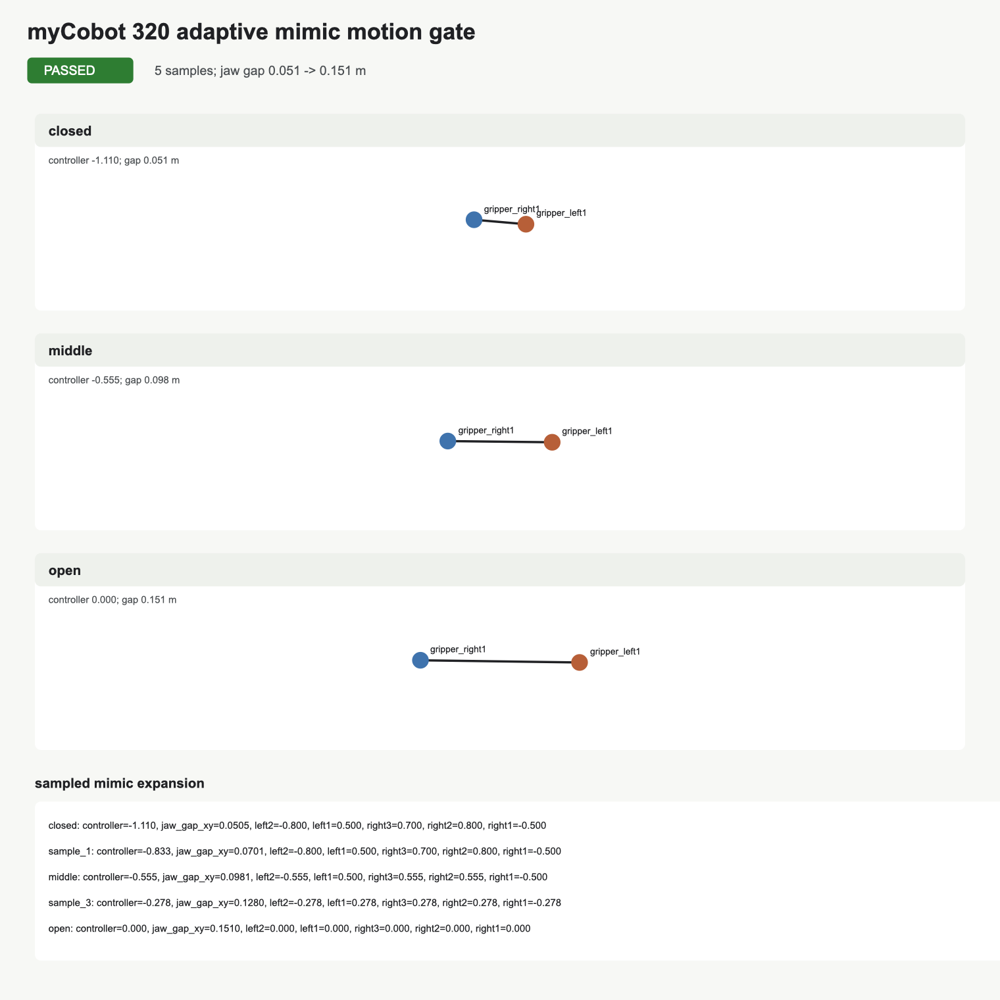

### Gate 6: Collision Proxy Design

Question: are contact geoms attached to the correct finger link frames?

Pass evidence:

- Only after Gates 1-5 pass, derive simple contact geoms from the validated
  finger link frames.
- Use boxes or capsules, not raw visual meshes, for grasp contact.
- The proxy geoms must be invisible or separately colored for debugging.
- Record local positions, sizes, friction, condim, and the link frame they are
  attached to.

Stop condition:

- Do not move contact pads based only on failed cube traces. Pad placement must
  come from the validated finger-link coordinate frames.

Current status: passed by
`scripts/verify_mycobot_320_adaptive_collision_proxy.py` against the ROS2
Humble adaptive gripper source. Evidence: both contact proxy geoms are derived
from official `gripper_left1` and `gripper_right1` mesh bounds, attached to the
matching validated finger link frames, and verified in the generated MuJoCo XML.
The pads are thin box proxies, not raw visual meshes. The current design uses
size `0.02636 0.006 0.006`, friction `80 8 8`, and `condim=6`.

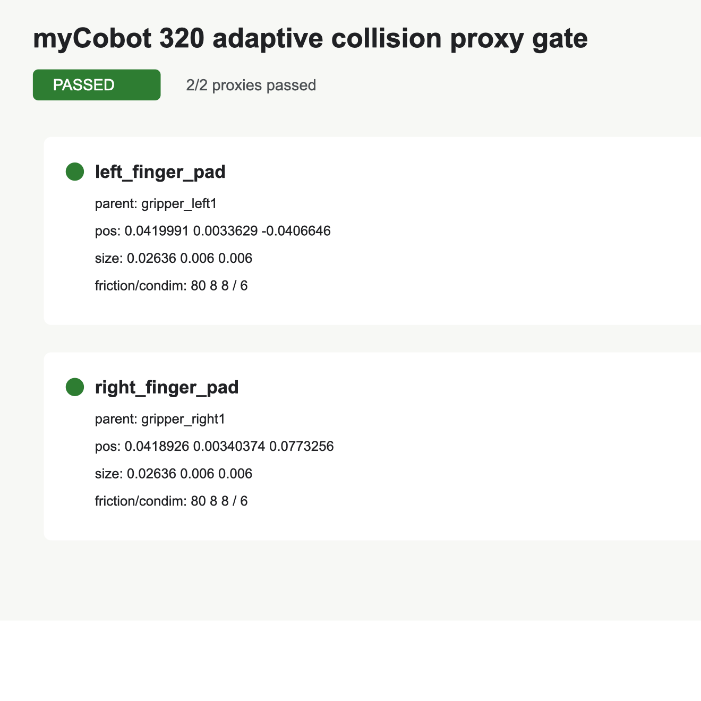

### Gate 7: Static Contact Smoke

Question: can the gripper close on a pre-positioned cube without arm motion?

Pass evidence:

- Start with the cube between validated finger contact geoms.
- Keep the arm fixed.
- Close the gripper slowly.
- Require sustained contacts from both finger sides for a fixed window.

Stop condition:

- If the cube is pushed out before both sides contact, return to Gate 5 or
  Gate 6.

### Gate 8: Natural Arm And Gripper Motion

Question: can the arm and adaptive gripper move together without abrupt jumps?

Pass evidence:

- Use a timed trajectory with separate phases:
  pregrasp, close, lift.
- Interpolate arm joints and gripper command with a smooth curve.
- The cube must remain in contact during close and lift.
- The final render/video must be visually inspected from multiple views.

Stop condition:

- If the arm sweeps the cube before close, reduce or remove pre-close arm
  motion. Do not solve this by moving the cube to an implausible place.

## Current Next Step

The next implementation should be Gate 7: static contact smoke. It must start
with the cube between the validated finger contact geoms, keep the arm fixed,
close the gripper slowly, and require sustained contacts from both sides before
any arm trajectory tuning.
