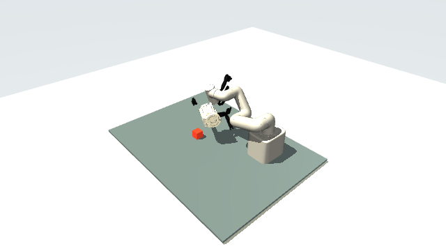
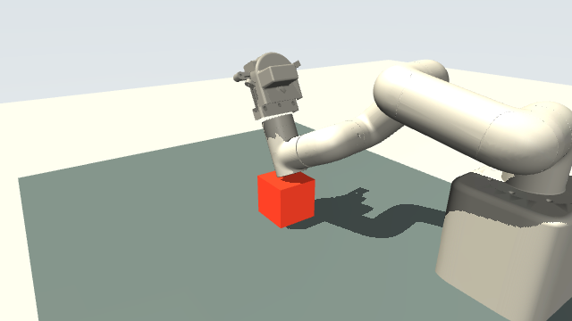
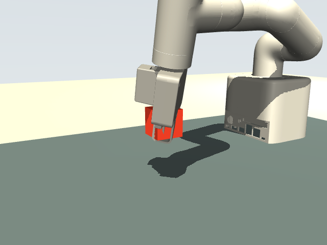
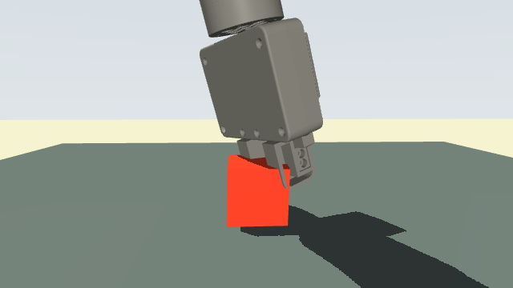
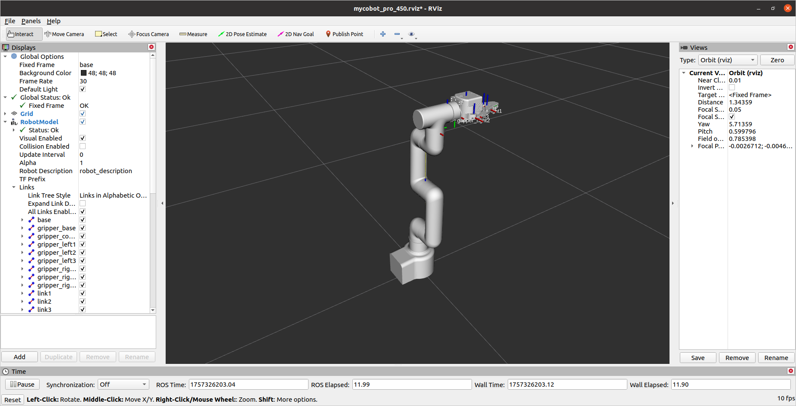

# myCobot ROS/Gazebo/MoveIt Teacher Dataset POC

This POC records the shortest path from the myCobot ROS/Gazebo/MoveIt stack to
a local teacher-data artifact that can later be converted into a full
LeRobotDataset.

## Source Check

- Official ROS1 repo: `https://github.com/elephantrobotics/mycobot_ros`
- Official myCobot 280 gripper source:
  `mycobot_description/urdf/mycobot_280_jn/mycobot_280_jn_parallel_gripper.urdf`
- Official myCobot 320 M5 2022 gripper source:
  `mycobot_description/urdf/mycobot_320_m5_2022/new_mycobot_pro_320_m5_2022_gripper.urdf`
- Official myCobot 320 M5 2022 adaptive gripper source:
  `mycobot_description/urdf/mycobot_320_m5_2022/mycobot_320_m5_2022_adaptive_gripper.urdf`
- Official Pro 450 force-gripper source:
  `mycobot_description/urdf/mycobot_pro_450/mycobot_pro_450_force_gripper.urdf`
- Official ROS1 MoveIt doc: `https://docs.elephantrobotics.com/docs/gitbook-en/12-ApplicationBaseROS/12.1-ROS1/12.1.5-Moveit/myCobot-280.html`
- Candidate ROS1 launch: `roslaunch mycobot_280_gripper_moveit demo_gazebo.launch gazebo_gui:=false`
- Smaller unofficial table-world candidate: `roslaunch mycobot_move_it_config demo_gazebo.launch gazebo_gui:=false`

The official ROS1 path has a myCobot 280 gripper MoveIt/Gazebo package with
trajectory-controller configuration for six arm joints plus a gripper joint.
That makes it a better teacher-data starting point than the thin
`mycobot_mujoco` model-only repo.

## POC Artifact

Mac-local one-command smoke:

```bash
sh scripts/run_mycobot_ros_teacher_poc_mac.sh
```

This writes `_workspace/mycobot_ros_teacher_poc_mac/report.json` and checks
that the frame rows, placeholder images, and `viewer.html` exist. It uses only
the Python standard library and does not require ROS, Gazebo, MoveIt, MuJoCo, or
LeRobot on the Mac.

To open the generated viewer with the macOS default browser:

```bash
OPEN_UI=1 sh scripts/run_mycobot_ros_teacher_poc_mac.sh
```

To generate real robot-arm render frames for the viewer, clone the official
myCobot MuJoCo asset repo and enable the renderer:

```bash
git clone https://github.com/elephantrobotics/mycobot_mujoco.git _vendor/mycobot_mujoco
RENDER_3D=1 sh scripts/run_mycobot_ros_teacher_poc_mac.sh
```

To run the proper myCobot-in-Nexus-style simulation POC instead of only
rendering dataset frames:

```bash
PYTHONPATH=src python3 scripts/mycobot_nexus_smoke.py \
  --asset-root _vendor/mycobot_mujoco \
  --output-dir _workspace/mycobot_nexus_smoke \
  --policy cube-approach
```

This creates a real `MyCobotNexusEnv` with MuJoCo `MjModel`/`MjData`, calls
`reset(seed)`, steps teacher-style 7D actions through a qpos-target controller,
uses the `cube-approach` Jacobian policy to move the TCP proxy toward the task
cube, renders the resulting scene, and writes a trace/report with initial,
final, and minimum TCP-to-cube distance. For dependency-light CI or code review,
the dry contract path records the env surface without importing MuJoCo:

The verified Mac-local cube-approach smoke reduced TCP-to-cube distance from
`0.518` to `0.237` over 16 steps with `approach_improved=true`.

To move from pure approach to contact-oriented simulation with the official
parallel gripper visual geometry, clone the official ROS description repo and
run the gripper/cube lift smoke:

```bash
git clone https://github.com/elephantrobotics/mycobot_ros.git _vendor/mycobot_ros

PYTHONPATH=src python3 scripts/mycobot_nexus_smoke.py \
  --asset-root _vendor/mycobot_mujoco \
  --official-gripper-root _vendor/mycobot_ros \
  --output-dir _workspace/mycobot_nexus_parallel_gripper_grasp_lift \
  --policy grasp-lift
```

This follows the official `mycobot_ros` 280 JN parallel-gripper assembly
documented in `mycobot_description/urdf/mycobot_280_jn/
mycobot_280_jn_parallel_gripper.urdf` and converts the official
`mycobot_description/urdf/parallel_gripper/*.dae` meshes to OBJ files under the
smoke output directory so MuJoCo can load them on macOS. The rendered gripper
visual geometry comes from the official parallel-gripper meshes; contact still
uses small transparent proxy pads attached to the official mimic-joint gripper
bodies. The task cube is smaller and closer to the reachable pre-grasp zone.

The verified Mac-local teacher grasp/lift smoke reached `grasp_success=true`,
`cube_lifted=true`, `final_cube_z=0.075`, `min_tcp_to_cube_dist=0.0018`, and
`gripper_cube_contacts=4` in 42 steps. The success label is
`teacher_grasp_lift_success`: after gripper closure near/contacting the cube,
the cube is explicitly attached to the midpoint of the finger contact pads so a
teacher dataset can record grasp/lift transitions before calibrated actuator
and force-closure modeling exists. This is simulation-state teacher supervision,
not a claim of physical force-closure.

Representative verified frames:






### Official 320 M5 2022 Adaptive Gripper Path

The more precise upstream source for the requested adaptive gripper is the ROS2
Humble model
`mycobot_description/urdf/mycobot_320_m5_2022/mycobot_320_m5_2022_adaptive_gripper.urdf`.
That file keeps the 320 M5 2022 arm meshes under
`mycobot_320_m5_2022/*.dae` but uses the dedicated
`pro_adaptive_gripper/*.dae` mesh family for `gripper_base`,
`gripper_left1/2/3`, and `gripper_right1/2/3`.

The older ROS1 file
`mycobot_320_m5_2022/new_mycobot_pro_320_m5_2022_gripper.urdf` remains useful
as a 320 gripper reference, but it is not the most exact source when the target
is specifically the upstream "adaptive gripper" model. The POC now exposes both
profiles:

- `--model-profile 320-m5-2022-gripper`: ROS1 320 M5 2022 gripper URDF.
- `--model-profile 320-m5-2022-adaptive-gripper`: ROS2 Humble 320 M5 2022
  adaptive gripper URDF with `pro_adaptive_gripper` meshes.

The adaptive gripper is a mimic-linkage assembly driven by
`gripper_controller` plus follower joints:
`gripper_base_to_gripper_left2`, `gripper_left3_to_gripper_left1`,
`gripper_base_to_gripper_right3`, `gripper_base_to_gripper_right2`, and
`gripper_right3_to_gripper_right1`. The MuJoCo conversion expands that mimic
mapping into per-joint qpos values and clamps each follower joint to the range
declared in the imported model so the linkage cannot be driven into obviously
invalid poses.

XML conversion and structure check:

```bash
PYTHONPATH=src python3 - <<'PY'
from pathlib import Path
from physical_ai_agent.sim.mycobot_nexus_env import build_mycobot_nexus_scene_model

build_mycobot_nexus_scene_model(
    model_path=Path(""),
    scene_path=Path("_workspace/mycobot_nexus_320_adaptive_xml_only/mycobot_nexus_scene.xml"),
    official_gripper_root=Path("_vendor/mycobot_ros2"),
    model_profile="320-m5-2022-adaptive-gripper",
)
PY
```

Current local evidence: the generated XML contains the six 320 arm joints, all
seven adaptive gripper bodies, the six mimic-linkage joints, `left_finger_pad`,
`right_finger_pad`, `mycobot_tcp_site`, and `task_cube`. This proves source
routing and scene generation, not yet a visually validated or contact-calibrated
MuJoCo grasp. On this Mac thread, both default Python and the bundled Codex
Python lack `mujoco`, so actual render/physics smoke is still pending a
MuJoCo-capable runtime.

Further adaptive-gripper work must follow
[`mycobot_320_adaptive_gripper_validation_ladder.md`](./mycobot_320_adaptive_gripper_validation_ladder.md).
Do not tune contact pads, cube placement, friction, or arm trajectory until the
URDF-vs-MuJoCo kinematic tree, mesh transform parity, visual pose, and mimic
motion gates have passed.

Target render/physics command once MuJoCo is available:

```bash
PYTHONPATH=src python3 scripts/mycobot_nexus_smoke.py \
  --model-profile 320-m5-2022-adaptive-gripper \
  --official-gripper-root _vendor/mycobot_ros2 \
  --asset-root _vendor/mycobot_mujoco \
  --output-dir _workspace/mycobot_nexus_320_adaptive_gripper_grasp \
  --steps 220 \
  --policy grasp-lift
```

### Pro 450 Reference Boundary

The Pro 450 product photos use a different end-effector family than the 280 JN
parallel gripper above. The official `mycobot_ros` reference for that assembly
is the full `mycobot_pro_450_force_gripper.urdf`, including the Pro 450 arm,
`gripper_connection`, and force-gripper links. Do not graft Pro 450 gripper
meshes onto the 280 MuJoCo arm by hand; that produces a non-official hybrid
assembly and visually invalid screenshots.

Official RViz reference copied from the upstream repo:



The correct next implementation path is a dedicated Pro 450 official-URDF
renderer/importer that preserves the entire URDF tree and Collada semantics.
Until that importer is verified visually against the upstream RViz reference,
the Pro 450 gripper should remain a reference image, not a claimed MuJoCo
simulation artifact.

```bash
python3 scripts/mycobot_nexus_smoke.py \
  --dry-contract \
  --output-dir _workspace/mycobot_nexus_contract
```

Use `REQUIRE_3D_RENDER=1` when the run should fail unless MuJoCo produces real
RGB frames:

```bash
MYCOBOT_MUJOCO_ROOT=_vendor/mycobot_mujoco \
REQUIRE_3D_RENDER=1 sh scripts/run_mycobot_ros_teacher_poc_mac.sh
```

To override the output path or size:

```bash
ROOT=_workspace/mycobot_ros_teacher_poc_mac_small \
FRAMES=4 WIDTH=32 HEIGHT=24 \
sh scripts/run_mycobot_ros_teacher_poc_mac.sh
```

Direct exporter run:

```bash
PYTHONPATH=. python3 scripts/export_mycobot_ros_teacher_poc.py \
  --root _workspace/mycobot_ros_teacher_poc \
  --overwrite
```

When a ROS/Gazebo JSONL trace is available:

```bash
INPUT_TRACE=_workspace/mycobot_ros_trace/joint_and_action_trace.jsonl \
sh scripts/run_mycobot_ros_teacher_poc_mac.sh
```

The script writes:

- `meta/info.json`: feature schema, joint order, source links, and claim boundary.
- `data/frames.jsonl`: one JSONL row per teacher frame.
- `data/episodes.jsonl`: one episode row with `success` intentionally unset.
- `images/top/*.ppm` and `images/wrist/*.ppm`: deterministic placeholder images
  so downstream viewers/converters can test image paths without ROS.
- `render/scene/*.bmp`: optional real myCobot MuJoCo robot-arm render frames
  generated from `elephantrobotics/mycobot_mujoco` assets in a nexus-style
  stage with a work mat, lighting, skybox, and task cube.
- `render/render_report.json` and `render/render_blocker.md`: renderer status
  and dependency/asset blocker details.
- `_workspace/mycobot_nexus_smoke/mycobot_nexus_trace.jsonl`: optional actual
  `MyCobotNexusEnv` reset/step trace.
- `_workspace/mycobot_nexus_smoke/mycobot_nexus_report.json`: optional actual
  simulation smoke report with observation/action dimensions and scene path.
- `_workspace/mycobot_nexus_parallel_gripper_grasp_lift/mycobot_nexus_report.json`:
  optional official-gripper visual grasp/lift smoke report with contact and
  cube-lift fields.
- `viewer.html`: standalone local UI with playback controls, real MuJoCo render
  frame slots, and state/action visualizations.
- `report.json`: POC status and next steps.

## Boundary

This is not yet a task-success dataset. It is an offline adapter POC for
MoveIt/Gazebo traces. A training-quality dataset still needs:

- real ROS topic capture for `/joint_states`, FollowJointTrajectory goals, and
  Gazebo camera images;
- Gazebo model-state object pose and gripper/contact success oracle;
- replacement of placeholder PPM images with decoded ROS image messages;
- calibrated MuJoCo actuators and contact-based grasp success in
  `MyCobotNexusEnv`;
- native Gazebo/MuJoCo RGB/depth camera streams if task training needs multiple
  rendered policy observations beyond the current scene render;
- fresh rollout filtering before any `save_episode()`-equivalent claim.
