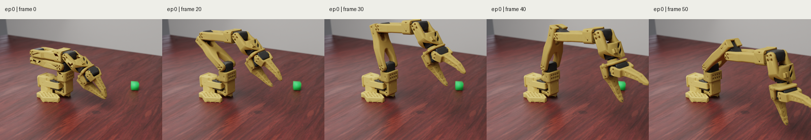

# SO101 Photoreal Render Preview Pipeline

This note records the optional high-fidelity SO101 render lane for dataset
generation. It is a sidecar preview path: the canonical LeRobot policy images
remain MuJoCo camera renders, while Blender/Cycles produces paper or inspection
renders under a separate `photoreal_preview/` directory.

## Example Output

Matte PLA material:


Material comparison:


SO101 home-to-cube dataset five-frame preview:



Procedural versus HDRI/PBR assets:


MyCobot adaptive gripper matte PLA material:


## One-Frame Render

Install Blender and fetch the optional CC0 assets:

```bash
brew install --cask blender
PYTHONPATH=src .venv/bin/python scripts/download_so101_photoreal_assets.py
```

Render one frame with Blender Cycles on Apple Metal:

```bash
PYTHONPATH=src .venv/bin/python scripts/render_so101_blender_probe.py \
  --output-dir _workspace/so101_blender_probe_matte_pla \
  --seed 7 \
  --warmup-steps 8 \
  --width 640 \
  --height 480 \
  --samples 512 \
  --denoise \
  --robot-material matte_pla
```

The measured local example on this Mac was:

- renderer: Blender Cycles
- acceleration: Metal, `Apple M5 Pro (GPU - 20 cores)`
- size: `640x480`
- samples: `512`
- denoise: enabled
- material: `matte_pla`
- render time: `7.85s` for the timed run

## Dataset Export Hook

Generate the normal dataset and add a preview sidecar:

```bash
PYTHONPATH=src .venv/bin/python scripts/export_so101_training_datasets.py \
  --only move_and_align_cube_edge_train_v2 \
  --overwrite \
  --photoreal-preview \
  --photoreal-robot-material matte_pla \
  --photoreal-samples 512
```

The hook writes the preview under:

```text
<recipe root>/photoreal_preview/
```

This does not replace `observation.images.camera1/camera2/camera3` in the
LeRobot dataset. It is intended for dataset QA, paper figures, and visually
checking simulation states with more realistic lighting/materials.

## SO101 Dataset Frame Preview

Five frames were rendered from the local home-start SO101 LeRobot dataset:

```text
_workspace/so101_lerobot/move_and_align_cube_edge_train_v2_delta_q_home_balanced_lr_104_ego_wrist_256_seed124000
```

The preview uses episode `0`, frames `0,20,30,40,50`. These rows start at the
home pose and move toward the visible green cube. The renderer reads
`observation.state` and `action` from the parquet rows, resets
`MuJoCoPickLift-v1` with the dataset seed, injects the robot qpos, and renders
the frame with Blender Cycles:

```bash
PYTHONPATH=src .venv/bin/python scripts/render_so101_dataset_blender_preview.py \
  --dataset-root _workspace/so101_lerobot/move_and_align_cube_edge_train_v2_delta_q_home_balanced_lr_104_ego_wrist_256_seed124000 \
  --output-dir _workspace/so101_dataset_photoreal_home_to_grip_5frames \
  --episode 0 \
  --frames 0,20,30,40,50 \
  --asset-root _workspace/photoreal_assets \
  --width 640 \
  --height 480 \
  --samples 192 \
  --denoise \
  --robot-material matte_pla
```

This is a sidecar visual preview, not an in-place mutation of the LeRobot
dataset. The robot qpos/action are row-derived; the cube pose comes from the
seeded `MuJoCoPickLift-v1` reset because the LeRobot parquet rows do not store
full object qpos.

## MyCobot Render

The same sidecar approach also works for the local MyCobot Nexus scene. MyCobot
visual evidence defaults to the adaptive gripper: `mycobot_ros2`,
`320-m5-2022-adaptive-gripper`, and the `adaptive-table` pose preset. Synthetic
or parallel-gripper renders should only be used for explicit legacy/debug
checks, not as the default MyCobot visual. The renderer exports MuJoCo mesh
geoms plus visible box primitives such as the cube and work mat, then
path-traces the static state in Blender:

```bash
PYTHONPATH=src .venv/bin/python scripts/render_mycobot_blender_probe.py \
  --official-gripper-root _workspace/_vendor/mycobot_ros2 \
  --render-asset-root _workspace/photoreal_assets \
  --output-dir _workspace/mycobot_blender_probe \
  --seed 7 \
  --warmup-steps 0 \
  --width 640 \
  --height 480 \
  --samples 256 \
  --denoise \
  --robot-material matte_pla
```

The measured local example on this Mac was:

- renderer: Blender Cycles
- acceleration: Metal, `Apple M5 Pro (GPU - 20 cores)`
- size: `640x480`
- samples: `256`
- denoise: enabled
- material: `matte_pla`
- model profile: `320-m5-2022-adaptive-gripper` with official `mycobot_ros2`
  adaptive gripper meshes
- pose preset: `adaptive-table`
- render time: `6.55s`

The adaptive asset/pose path was also checked with:

```bash
PYTHONPATH=src .venv/bin/python scripts/verify_mycobot_320_adaptive_visual_pose.py \
  --official-gripper-root _workspace/_vendor/mycobot_ros2
PYTHONPATH=src .venv/bin/python scripts/verify_mycobot_320_adaptive_mimic_motion.py \
  --official-gripper-root _workspace/_vendor/mycobot_ros2
```

## Assets

- HDRI: Poly Haven `studio_small_08`, CC0.
- Table PBR: ambientCG `Wood008`, CC0.
- Plastic normal/roughness source: ambientCG `Plastic013A`, CC0.

If assets are missing, the Blender probe still runs with procedural fallbacks,
but the HDRI/PBR output is more realistic.
