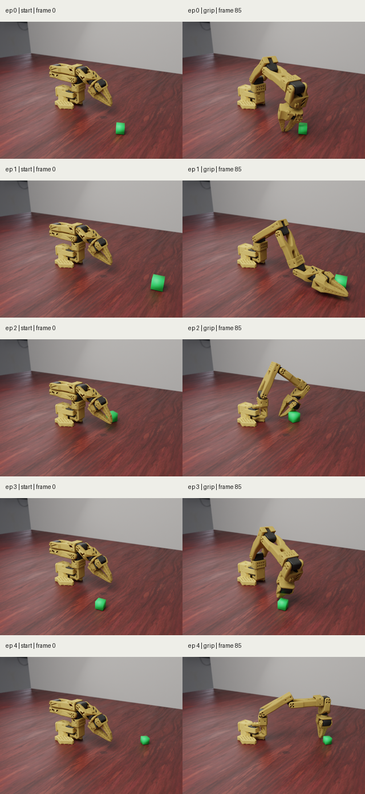
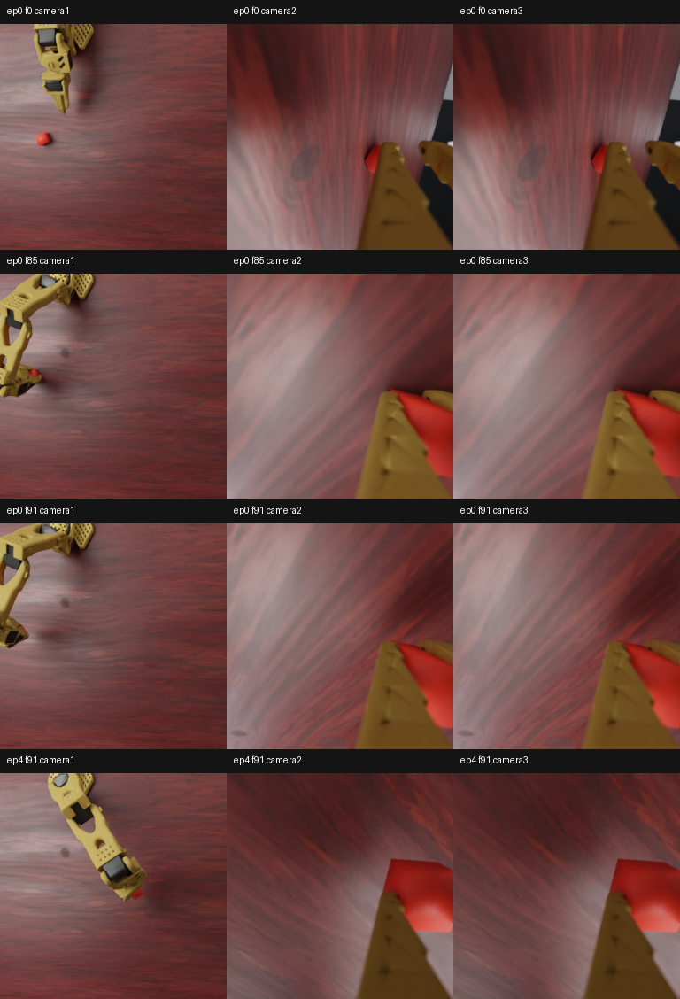
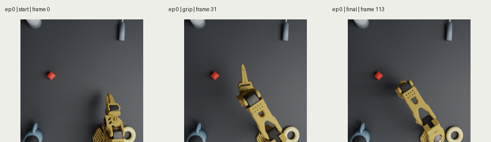
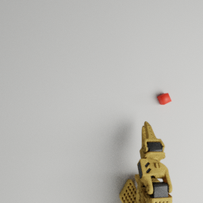
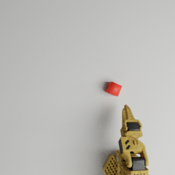

# SO101 Photoreal Render Preview Pipeline

This note records the high-fidelity SO101 render lane for dataset generation.
The current training path can build a photoreal dataset root with the same
episode/frame/action/state contract as the source LeRobot dataset. Legacy
one-frame probes and preview sidecars are still useful for inspection, but the
training artifact is the `so101_photoreal_jsonl_v1` dataset under
`_workspace/so101_photoreal_datasets/`, or the training-ready
`so101_photoreal_lerobot_v1` parquet root under
`_workspace/so101_photoreal_lerobot/`.

## Example Output

Matte PLA material:


Material comparison:


SO101 `pick_cube_train` five-episode start/grip preview:



SO101 photoreal dataset frames using the stable training-view render profile:



Procedural versus HDRI/PBR assets:


MyCobot adaptive gripper matte PLA material:


## One-Frame Render

Install Blender and fetch the optional CC0 assets:

```bash
brew install --cask blender
PYTHONPATH=src .venv/bin/python scripts/download_so101_photoreal_assets.py
```

Render one frame with Blender Cycles on Apple Metal:

```bash
PYTHONPATH=src .venv/bin/python scripts/render_so101_blender_probe.py \
  --output-dir _workspace/so101_blender_probe_matte_pla \
  --seed 7 \
  --warmup-steps 8 \
  --width 640 \
  --height 480 \
  --samples 512 \
  --denoise \
  --robot-material matte_pla
```

The measured local example on this Mac was:

- renderer: Blender Cycles
- acceleration: Metal, `Apple M5 Pro (GPU - 20 cores)`
- size: `640x480`
- samples: `512`
- denoise: enabled
- material: `matte_pla`
- render time: `7.85s` for the timed run

## Dataset Export Hook

Generate the normal dataset and, if needed, add an inspection preview sidecar:

```bash
PYTHONPATH=src .venv/bin/python scripts/export_so101_training_datasets.py \
  --only move_and_align_cube_edge_train_v2 \
  --overwrite \
  --photoreal-preview \
  --photoreal-robot-material matte_pla \
  --photoreal-samples 512
```

The hook writes the preview under:

```text
<recipe root>/photoreal_preview/
```

This preview hook does not replace `observation.images.camera1/camera2/camera3`
in the LeRobot dataset. Use the full photoreal dataset contract below when the
rendered images should become the training input.

## SO101 Dataset Episode Preview

Five episodes were rendered from the existing SO101 `pick_cube_train` LeRobot
training set:

```text
_workspace/so101_lerobot/pick_cube_train50_ego_wrist_256_seed98200
```

This is the recipe-backed home-start cube-grip training set:

- recipe: `pick_cube_train`
- export script: `scripts/export_so101_teacher_rollouts_lerobot.py`
- task: `pick_cube`
- seed: `98200`
- start mode: `home`
- teacher style: `staged`
- phase settings: `approach_steps=34`, `settle_steps=10`,
  `close_steps=42`, `lift_steps=58`

The preview uses episodes `0,1,2,3,4` and renders each episode's `start` frame
plus the computed `grip` frame. The renderer reads `observation.state` and
`action` from the parquet rows, resets the same high-contrast PickLift env
factory used by the dataset exporter, uses the actual per-episode seed recorded
in `so101_lerobot_export_report.json`, injects the robot qpos, and renders the
frame with Blender Cycles:

```bash
PYTHONPATH=src:.:scripts .venv/bin/python scripts/render_so101_dataset_blender_preview.py \
  --dataset-root _workspace/so101_lerobot/pick_cube_train50_ego_wrist_256_seed98200 \
  --output-dir _workspace/so101_dataset_photoreal_pick_cube_train5episodes \
  --env-source high_contrast_picklift \
  --episodes 0,1,2,3,4 \
  --frames start,grip \
  --asset-root _workspace/photoreal_assets \
  --width 640 \
  --height 480 \
  --samples 192 \
  --denoise \
  --robot-material matte_pla \
  --camera-lens 35
```

This command is an inspection preview, not the training dataset. The robot
qpos/action are row-derived; object pose is recreated by resetting the
export-compatible env with the report-backed per-episode seed because the
LeRobot parquet rows do not store full object qpos.

## SO101 Photoreal Dataset Contract

To make rendered frames visible as an actual dataset, build an
`so101_photoreal_jsonl_v1` root from a rendered frame directory. The builder is
strict by default: selected source episodes must preserve their original frame
counts and all policy camera keys:

Camera alignment is metadata-driven, not visually hand-tuned. For every rendered
source row, `scripts/render_so101_dataset_blender_preview.py` uses the replayed
MuJoCo state and the same `_make_camera(...)` route used by
`scripts/export_so101_teacher_rollouts_lerobot.py`. `camera1` uses the native
MuJoCo free-camera scene pose and applies the same egocentric postprocess
rotation contract as the source dataset. `camera2` uses the fixed MuJoCo
`wrist_cam` pose from `data.cam_xpos` and `data.cam_xmat`, which avoids the
near-field offset introduced by the intermediate renderer scene camera. The
`--camera-lens` value is only a fallback for cameras without MuJoCo FOV
metadata.

The training-view render profile is intentionally stable rather than decorative:
it disables depth of field, uses a fixed Cycles seed with animated seed off,
runs with denoising disabled for temporal consistency, clamps indirect samples,
removes the background wall, and uses a neutral matte tabletop. That avoids the
frame-to-frame shimmer seen in the earlier low-sample wood/PBR preview.

The optional `black_table_clutter` scene profile replaces only the Blender
tabletop and adds procedural workshop props outside the protected manipulation
zone. The mug, bottle, masking tape, and screwdriver never enter MuJoCo, so they
cannot change collisions, source actions, or grasp dynamics. Their small pose
variation is derived from the recorded episode seed and stays fixed across all
frames and cameras in that episode:

```bash
PYTHONPATH=src:.:scripts .venv/bin/python scripts/render_so101_dataset_blender_preview.py \
  --dataset-root _workspace/so101_lerobot/grip_the_cube_v1_2_train_shard00_seed492500 \
  --output-dir _workspace/so101_photoreal_renders/black_table_clutter_sample_ep0000 \
  --env-source high_contrast_picklift \
  --episode 0 --frames start,grip,final \
  --width 256 --height 256 --samples 256 \
  --robot-material matte_pla \
  --scene-profile black_table_clutter
```



Object/contact dynamics are also replay-based. The renderer resets each source
episode once with the seed recorded in `so101_lerobot_export_report.json`,
renders the pre-action frame, then steps the source `action` before the next
frame. It does not reset the environment per row, because that would keep the
cube at the reset pose and break grasp/lift continuity.

```bash
PYTHONPATH=src:.:scripts .venv/bin/python scripts/render_so101_dataset_blender_preview.py \
  --dataset-root _workspace/so101_lerobot/pick_cube_train50_ego_wrist_256_seed98200 \
  --output-dir _workspace/so101_photoreal_renders/pick_cube_train5episodes_full_256_seed98200 \
  --env-source high_contrast_picklift \
  --episodes 0,1,2,3,4 \
  --frames all \
  --asset-root _workspace/photoreal_assets \
  --width 256 --height 256 --samples 256 \
  --robot-material matte_pla --camera-lens 35
```

```bash
PYTHONPATH=src:.:scripts .venv/bin/python scripts/build_so101_photoreal_dataset.py \
  --source-dataset-root _workspace/so101_lerobot/pick_cube_train50_ego_wrist_256_seed98200 \
  --rendered-dir _workspace/so101_photoreal_renders/pick_cube_train5episodes_full_256_seed98200 \
  --output-root _workspace/so101_photoreal_datasets/pick_cube_train5episodes_full_256_seed98200 \
  --episodes 0,1,2,3,4 \
  --overwrite
```

The rendered directory must contain one PNG per source episode/frame/camera,
using names like:

```text
episode_0000_frame_0000_camera1.png
episode_0000_frame_0000_camera2.png
episode_0000_frame_0001_camera1.png
...
```

For `pick_cube_train` episode `0..4`, this means the output must preserve the
source lengths `[92, 92, 93, 92, 92]`, source image shape `[256, 256, 3]`,
and expose:

- `observation.images.camera1`: photoreal `egocentric_cam`
- `observation.images.camera2`: photoreal `wrist_cam`
- `observation.images.camera3`: photoreal `wrist_cam duplicate`
- `observation.state`
- `action`

If any required frame or camera is missing, the builder fails instead of
creating a misleading partial dataset. The Data Viewer discovers completed
roots under `_workspace/so101_photoreal_datasets/` and lists them as separate
`Photoreal datasets` entries.

The local generated full dataset used for dashboard QA is:

- `_workspace/so101_photoreal_datasets/pick_cube_train5episodes_full_256_seed98200`
- 5 episodes, 461 frames total
- 461 PNGs for each of `camera1`, `camera2`, and `camera3`

For training/evaluation configs that need LeRobot parquet roots, use the
strict parquet-image replacement builder. It copies the source LeRobot root,
preserves state/action/timestamp/task metadata, replaces the embedded
`observation.images.camera1/camera2/camera3` bytes with RGB photoreal PNGs,
and writes `photoreal_lerobot_manifest.json`.

The old local `pick_from_top_cube_loop_validation10` photoreal derivative is
intentionally not registered as a training dataset. Its source prompts used the
legacy `visible ... cube` wording and visual review showed the rendered final
frame could disagree with the source success metadata, so the active
photoreal training lane is the full `pick_cube` train/eval pair below.

For `pick_cube_train` and `pick_cube_val`, do not keep the legacy generic
prompt from the source parquet:

```text
Grasp the visible cube and lift it up.
```

The photoreal LeRobot converter should be run with
`--rewrite-color-task-prompts`, which resets the source episode seed in the
same export-compatible environment and resolves the target object color from
the environment metadata. The resulting `tasks.parquet` and row `task_index`
entries use concrete prompts such as:

```text
Grasp the red cube and lift it up.
Grasp the green cube and lift it up.
Grasp the blue cube and lift it up.
```

The full `pick_cube` photoreal train/eval targets are:

- `_workspace/so101_photoreal_lerobot/pick_cube_train50_ego_wrist_256_seed98200_samples256_nodenoise`
- `_workspace/so101_photoreal_lerobot/pick_cube_valid24_ego_wrist_256_seed98100_samples256_nodenoise`
- `training_ready=true`
- stable render profile: `samples=256`, denoise disabled, DOF off, fixed Cycles
  seed, neutral matte tabletop, no background wall

Example frames committed for PR review:





## MyCobot Render

The same sidecar approach also works for the local MyCobot Nexus scene. MyCobot
visual evidence defaults to the adaptive gripper: `mycobot_ros2`,
`320-m5-2022-adaptive-gripper`, and the `adaptive-table` pose preset. Synthetic
or parallel-gripper renders should only be used for explicit legacy/debug
checks, not as the default MyCobot visual. The renderer exports MuJoCo mesh
geoms plus visible box primitives such as the cube and work mat, then
path-traces the static state in Blender:

```bash
PYTHONPATH=src .venv/bin/python scripts/render_mycobot_blender_probe.py \
  --official-gripper-root _workspace/_vendor/mycobot_ros2 \
  --render-asset-root _workspace/photoreal_assets \
  --output-dir _workspace/mycobot_blender_probe \
  --seed 7 \
  --warmup-steps 0 \
  --width 640 \
  --height 480 \
  --samples 256 \
  --denoise \
  --robot-material matte_pla
```

The measured local example on this Mac was:

- renderer: Blender Cycles
- acceleration: Metal, `Apple M5 Pro (GPU - 20 cores)`
- size: `640x480`
- samples: `256`
- denoise: enabled
- material: `matte_pla`
- model profile: `320-m5-2022-adaptive-gripper` with official `mycobot_ros2`
  adaptive gripper meshes
- pose preset: `adaptive-table`
- render time: `6.55s`

The adaptive asset/pose path was also checked with:

```bash
PYTHONPATH=src .venv/bin/python scripts/verify_mycobot_320_adaptive_visual_pose.py \
  --official-gripper-root _workspace/_vendor/mycobot_ros2
PYTHONPATH=src .venv/bin/python scripts/verify_mycobot_320_adaptive_mimic_motion.py \
  --official-gripper-root _workspace/_vendor/mycobot_ros2
```

## Assets

- HDRI: Poly Haven `studio_small_08`, CC0.
- Table PBR: ambientCG `Wood008`, CC0.
- Plastic normal/roughness source: ambientCG `Plastic013A`, CC0.

If assets are missing, the Blender probe still runs with procedural fallbacks,
but the HDRI/PBR output is more realistic.
