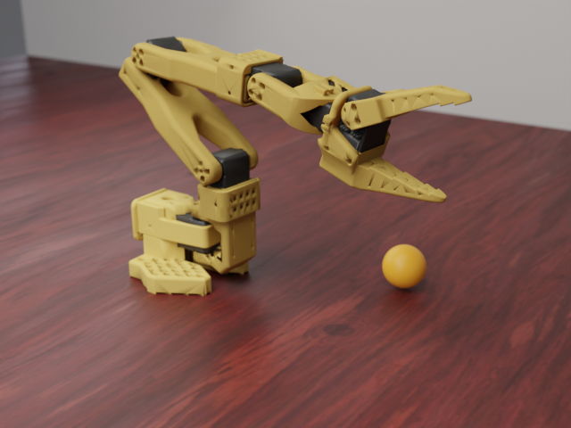
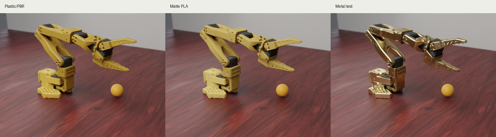
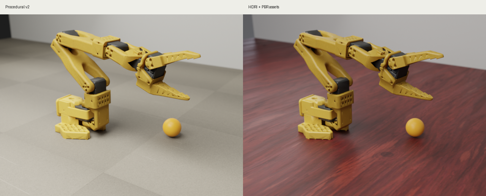
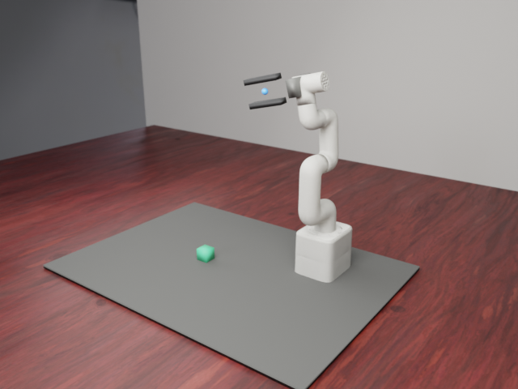

# SO101 Photoreal Render Preview Pipeline

This note records the optional high-fidelity SO101 render lane for dataset
generation. It is a sidecar preview path: the canonical LeRobot policy images
remain MuJoCo camera renders, while Blender/Cycles produces paper or inspection
renders under a separate `photoreal_preview/` directory.

## Example Output

Matte PLA material:



Material comparison:



Procedural versus HDRI/PBR assets:



MyCobot matte PLA material:



## One-Frame Render

Install Blender and fetch the optional CC0 assets:

```bash
brew install --cask blender
PYTHONPATH=src .venv/bin/python scripts/download_so101_photoreal_assets.py
```

Render one frame with Blender Cycles on Apple Metal:

```bash
PYTHONPATH=src .venv/bin/python scripts/render_so101_blender_probe.py \
  --output-dir _workspace/so101_blender_probe_matte_pla \
  --seed 7 \
  --warmup-steps 8 \
  --width 640 \
  --height 480 \
  --samples 512 \
  --denoise \
  --robot-material matte_pla
```

The measured local example on this Mac was:

- renderer: Blender Cycles
- acceleration: Metal, `Apple M5 Pro (GPU - 20 cores)`
- size: `640x480`
- samples: `512`
- denoise: enabled
- material: `matte_pla`
- render time: `7.85s` for the timed run

## Dataset Export Hook

Generate the normal dataset and add a preview sidecar:

```bash
PYTHONPATH=src .venv/bin/python scripts/export_so101_training_datasets.py \
  --only move_and_align_cube_edge_train_v2 \
  --overwrite \
  --photoreal-preview \
  --photoreal-robot-material matte_pla \
  --photoreal-samples 512
```

The hook writes the preview under:

```text
<recipe root>/photoreal_preview/
```

This does not replace `observation.images.camera1/camera2/camera3` in the
LeRobot dataset. It is intended for dataset QA, paper figures, and visually
checking simulation states with more realistic lighting/materials.

## MyCobot Render

The same sidecar approach also works for the local MyCobot Nexus scene. The
renderer exports MuJoCo mesh geoms plus box primitives such as the cube, work
mat, palm, and finger pads, then path-traces the static state in Blender:

```bash
PYTHONPATH=src .venv/bin/python scripts/render_mycobot_blender_probe.py \
  --asset-root _workspace/_vendor/mycobot_mujoco \
  --render-asset-root _workspace/photoreal_assets \
  --output-dir _workspace/mycobot_blender_probe \
  --seed 7 \
  --warmup-steps 8 \
  --width 640 \
  --height 480 \
  --samples 256 \
  --denoise \
  --robot-material matte_pla
```

The measured local example on this Mac was:

- renderer: Blender Cycles
- acceleration: Metal, `Apple M5 Pro (GPU - 20 cores)`
- size: `640x480`
- samples: `256`
- denoise: enabled
- material: `matte_pla`
- render time: `5.83s`

## Assets

- HDRI: Poly Haven `studio_small_08`, CC0.
- Table PBR: ambientCG `Wood008`, CC0.
- Plastic normal/roughness source: ambientCG `Plastic013A`, CC0.

If assets are missing, the Blender probe still runs with procedural fallbacks,
but the HDRI/PBR output is more realistic.
