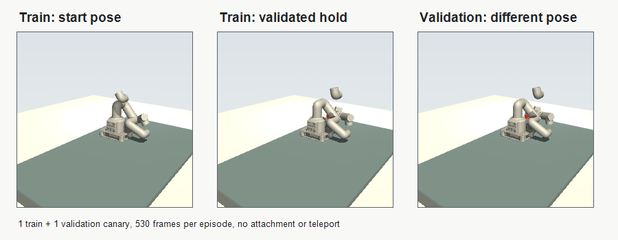

# myCobot 280 SmolVLA Readiness Evidence - 2026-07-30

This note is the PR evidence bundle for integrating the merged deterministic
myCobot 280 teacher dataset with the SmolVLA fine-tuning readiness lane. The
source dataset landed on `origin/main` in commit `6281793` and was integrated
into the readiness worktree by merge commit `7c67e7b`.

## What Changed

- Added a frozen 50-train/10-validation pose-diverse dataset config.
- Taught the validator and LeRobot adapter to consume split manifests at
  `splits.<name>.episode_summaries` while retaining legacy manifest support.
- Added explicit `--split train` and `--split validation` conversion plans.
- Made tiny checkpoints save LeRobot's preprocessor and postprocessor configs.
- Added regression coverage for split selection and reloadable checkpoint artifacts.

## Canary Dataset

The executable canary generated one train episode and one held-out validation
episode with all frames rendered at 256 x 256.



| Gate | Result |
| --- | ---: |
| Requested / accepted episodes | 2 / 2 |
| Train / validation episodes | 1 / 1 |
| Total rendered frames | 1,060 |
| Unique object poses / trajectory hashes | 2 / 2 |
| Minimum final cube lift | 0.0541356 m |
| Minimum post-lift hold cube lift | 0.0452369 m |
| Minimum sustained two-pad lift contact | 80 steps |
| Minimum sustained post-lift two-pad contact | 300 steps |
| Maximum pad-cube penetration | 0.00282596 m |
| Rejected attempts | 0 |

Source artifact:

```text
_workspace/mycobot_teacher_datasets/
  mycobot_280_ground_pickup_pose_diverse_canary_1train_1val_allframes_20260730/
```

Human-visible inspection confirmed the cube starts on the mat and remains held
between the pads above the mat in both final frames. Metadata also reports
`teacher_attachment_enabled=false` and
`object_teleport_during_pickup_lift=false`.

## LeRobot Adaptation

The train and validation splits were independently exported and converted to
native LeRobot datasets:

```text
_workspace/mycobot280_lerobot/
  ground_pickup_pose_diverse_canary_20260730_train_native/
  ground_pickup_pose_diverse_canary_20260730_validation_native/
```

Each dataset contains one episode and 530 frames with:

- `observation.state`: 7 values
- `action`: 7 values
- `observation.images.camera1`: 256 x 256 RGB
- contact, cube pose, and penetration metadata retained for later analysis

The 7D dimensions are declared by the myCobot dataset feature schema. SmolVLA's
policy factory builds matching input/output normalization processors from that
metadata; it does not pad myCobot data into SO101's 6D action space.

## Tiny Fine-Tune And Reload

The canary used cached `lerobot/smolvla_base` weights and the existing approved
repo-local LeRobot environment. No package or model download was required for
the run.

| Gate | Result |
| --- | ---: |
| Device | CUDA |
| Optimizer steps | 1 |
| Training loss | 0.7874445 |
| Clipped gradient norm | 27.7995 |
| Training duration | 20.3673 s |
| Held-out validation batches | 1 |
| Held-out supervised loss | 0.7701402 |
| Postprocessed action RMSE mean | 0.5528774 |
| Postprocessed step-0 action RMSE | 0.2823237 |

Training and reload artifacts:

```text
_workspace/mycobot280_training/
  ground_pickup_pose_diverse_canary_finetune_reloadable_20260730/
    tiny_finetune.json
    train.log
    tensorboard/events.out.tfevents.*
    validation_supervised_loss.json
    checkpoints/latest/optimizer_state.pt
    checkpoints/latest/training_state.json
    checkpoints/latest/pretrained_model/model.safetensors
    checkpoints/latest/pretrained_model/policy_preprocessor.json
    checkpoints/latest/pretrained_model/policy_postprocessor.json
```

The held-out evaluator loaded weights and processors from the saved local
checkpoint. This closes the earlier weights-only reload defect.

## Claim Boundary And Next Gate

This evidence proves source validation, split-aware conversion, 7D feature
compatibility, one real optimizer step, complete artifact writing, and local
checkpoint reload. It does not prove learned closed-loop task success,
generalization, randomized-object robustness, or an agentic improvement.

The next data-producing sequence is:

1. Complete and validate the frozen 50-train/10-validation dataset.
2. Convert both native LeRobot splits.
3. Run a bounded fine-tune with a held-out loss curve.
4. Compare unfine-tuned and fine-tuned policies in closed-loop simulation.
5. Add the verifier/retry condition only after the policy-only baseline exists.
