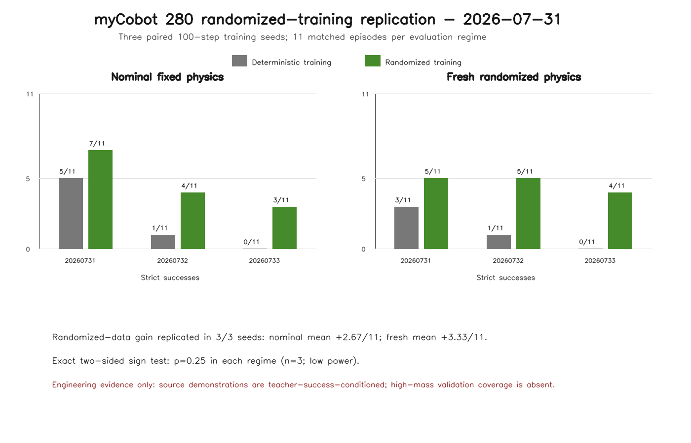

# myCobot 280 Randomized-Training SmolVLA Multi-Seed Replication

**Date:** 2026-07-31 PDT

**Branch:** `codex/mycobot280-randomized-smolvla-eval`

**Parent evidence:**
`docs/research/2026_07_31/mycobot280_randomized_training_pilot_evidence.md`

## Question

Does the strict-success improvement from randomized close-camera training persist
across multiple SmolVLA fine-tuning seeds when deterministic-close and
randomized-close checkpoints use the same 100-step recipe and receive matched
closed-loop evaluation schedules?

In this three-training-seed replication, the direction persisted in every pair:

- nominal fixed physics: randomized training improved strict success in `3/3`
  training seeds, with per-seed gains of `+2/11`, `+3/11`, and `+3/11`;
- fresh randomized physics: randomized training improved strict success in
  `3/3` training seeds, with per-seed gains of `+2/11`, `+4/11`, and `+4/11`;
- mean maximum penetration fell by 0.087 mm nominally and 0.082 mm under fresh
  randomization;
- absolute success remained training-seed-sensitive, especially for the
  deterministic-close checkpoints.

This strengthens the original one-seed pilot into replicated engineering
evidence. It is not yet a publication-level robustness estimate: the true
replication count is three, the exact two-sided sign test is `p=0.25`, and the
randomized demonstrations are teacher-success-conditioned.



## Experimental Contract

Each training condition used:

- base policy `lerobot/smolvla_base` from the local cache;
- 100 optimizer steps, batch size 1, learning rate `1e-5`;
- CUDA with local files only;
- exact 7D state/action processors;
- the constant-joint normalization safeguard;
- a reloadable model, optimizer state, processor configs, feature contract,
  train log, and TensorBoard events.

Training seeds were `20260731`, `20260732`, and `20260733`. The deterministic
condition used the matched close-camera deterministic corpus. The randomized
condition used the existing audited 50-episode randomized training corpus.

Every closed-loop cell used:

- `ground_pickup_closeup` at 256 x 256 RGB;
- 530 policy-controlled MuJoCo steps;
- the same prompt, gravity schedule, scene, and strict verifier;
- no cube pose, contact metrics, or MuJoCo state as policy input;
- no teacher attachment or object teleport;
- an unchanged maximum penetration cap of 3.0 mm.

Nominal evaluation reused fixed-physics seeds 91000-91010. Fresh randomized
evaluation reused direct, unfiltered manifest draws at seeds 92000-92010.
Those fresh seeds overlap none of the 73 accepted or rejected source attempts.
Within each training seed, both checkpoint types received identical schedules
and candidate dictionaries. Across training seeds, environment seeds,
yaw values, and candidate dictionaries remained fixed while policy sampling
seeds followed the training seed.

The full matrix contains 132 episodes:

```text
3 training seeds x 2 training datasets x 2 evaluation regimes x 11 episodes
```

## Per-Seed Results

| Training seed | Det. nominal | Rand. nominal | Delta | Det. fresh | Rand. fresh | Delta |
| ---: | ---: | ---: | ---: | ---: | ---: | ---: |
| 20260731 | 5/11 | 7/11 | +2/11 | 3/11 | 5/11 | +2/11 |
| 20260732 | 1/11 | 4/11 | +3/11 | 1/11 | 5/11 | +4/11 |
| 20260733 | 0/11 | 3/11 | +3/11 | 0/11 | 4/11 | +4/11 |

The randomized-data direction was positive in all three paired training seeds
under both evaluation regimes. With only three nonzero paired signs, the exact
two-sided sign test is `p=0.25`; this is descriptive replication, not a claim of
statistical significance.

## Aggregate Description

Episode pooling is reported only as a descriptive summary. Episodes sharing a
training checkpoint are not independent training replications.

| Training data | Evaluation physics | Strict total | Mean per seed | Seed range | Pickup + hold |
| --- | --- | ---: | ---: | ---: | ---: |
| Deterministic close | Nominal fixed | 6/33 | 2.00/11 | 0-5 | 32/33 |
| Randomized close | Nominal fixed | 14/33 | 4.67/11 | 3-7 | 32/33 |
| Deterministic close | Fresh randomized | 4/33 | 1.33/11 | 0-3 | 32/33 |
| Randomized close | Fresh randomized | 14/33 | 4.67/11 | 4-5 | 33/33 |

Randomized training reduced mean maximum penetration on 27/33 paired nominal
episodes and 25/33 paired fresh-randomized episodes. Mean paired deltas were
-0.087 mm and -0.082 mm, respectively.

`Pickup + hold` excludes only the penetration cap while retaining the 50 mm
final-lift, two-final-pad-contact, 60-step sustained-lift, 300-step post-lift
hold, and 45 mm minimum post-hold height gates. It is shown beside strict
success rather than replacing it.

## High-Mass Slice

The fresh direct-draw schedule contains three candidates in the highest mass
quartile, 0.034-0.036 kg. Repeating that schedule over three training seeds
produced nine high-mass evaluations per training condition:

| Training data | High-mass strict success |
| --- | ---: |
| Deterministic close | 0/9 |
| Randomized close | 3/9 |

This is encouraging but highly exploratory. The source teacher accepted only
2/15 attempted candidates in this quartile, all 13 source rejections occurred
there, and validation contains zero accepted high-mass examples. The 3/9 result
must not be interpreted as established high-mass robustness.

## Held-Out Diagnostics

All six checkpoints used the same first 20 batches from the accepted randomized
validation split. Each checkpoint used its own saved training-split processor
statistics.

| Training seed | Det. loss | Rand. loss | Det. action RMSE | Rand. action RMSE |
| ---: | ---: | ---: | ---: | ---: |
| 20260731 | 4.9898 | 5.0859 | 0.10869 | 0.10652 |
| 20260732 | 4.6080 | 4.7329 | 0.10405 | 0.10105 |
| 20260733 | 5.2849 | 5.4176 | 0.11066 | 0.11105 |
| Mean | 4.9609 | 5.0788 | 0.10780 | 0.10621 |

Randomized training has slightly higher mean held-out loss but slightly lower
mean postprocessed action RMSE. Their disagreement, together with the weak
relationship to strict closed-loop success, reinforces that neither diagnostic
is a task-success proxy.

## What This Proves

- The exact-7D SmolVLA training, checkpoint, reload, and closed-loop pipeline is
  reproducible across at least three training seeds for both datasets.
- Randomized-close training improved strict success relative to its
  deterministic-close pair in all three tested training seeds and both tested
  evaluation regimes.
- The result is not driven only by seed `20260731`; seeds `20260732` and
  `20260733` preserve and enlarge the paired gain.
- Randomized training reduced penetration slightly and consistently enough to
  move more episodes below the unchanged 3 mm strict cap.
- Training-seed variance is material and must remain visible in future tables.

## What This Does Not Prove

- statistical significance or a publication-ready confidence interval with
  only three independent training seeds;
- uniform source coverage over mass and friction;
- established high-mass robustness;
- convergence or optimal checkpoint selection after 100 steps;
- robustness to unseen size, translation, camera perturbation, clutter, or
  recovery states;
- real-robot transfer or agentic verifier/retry benefit;
- superiority over SO101, LIBERO, or another policy family.

## Storage And Safety

Four new checkpoints were written sequentially for seeds `20260732` and
`20260733`. Their combined size is about 5.28 GB, below the agreed 6 GB cap.
Each individual checkpoint was about 1.320 GB and stayed below the 1.5 GiB
per-checkpoint stop gate.

Final measured state after the fourth checkpoint:

- Windows `C:` free: 5,771,972,608 bytes;
- WSL available: 856,727,957,504 bytes;
- WSL VHDX length: 228,602,150,912 bytes, unchanged throughout;
- no dataset was duplicated and no representative-frame dump was enabled.

## Evidence Paths

Committed evidence:

- `scripts/summarize_mycobot280_randomized_training_multiseed.py`
- `tests/test_mycobot280_randomized_training_multiseed_summary.py`
- `docs/research/2026_07_31/mycobot280_randomized_training_multiseed_summary.json`
- `docs/research/2026_07_31/mycobot280_randomized_training_multiseed.png`

Local generated artifacts:

- new checkpoints: `_workspace/mycobot280_training/*_seed20260732/` and
  `_workspace/mycobot280_training/*_seed20260733/`;
- new closed-loop reports:
  `_workspace/mycobot280_eval/multiseed_20260731/`;
- held-out supervised reports in the same evaluation root plus the existing
  seed-one randomized report.

The summarizer validates all 12 closed-loop reports before emitting the JSON or
figure. The figure was generated at 1400 x 900. Manual visual inspection remains
pending because the Codex Windows filesystem preview helper failed with a
sandbox refresh error; this does not affect the underlying JSON validation.

## Recommended Next Step

This replication is strong enough to include in the current PR and is more
valuable than extending one checkpoint to more evaluation episodes. The next
publication-value step should fix the source-distribution weakness: generate a
small stratified or deliberately oversampled high-mass extension with accepted
validation examples in every mass and friction quartile, then repeat this
paired three-seed protocol on a larger fresh schedule. Preserve strict and
pickup/hold metrics separately.
