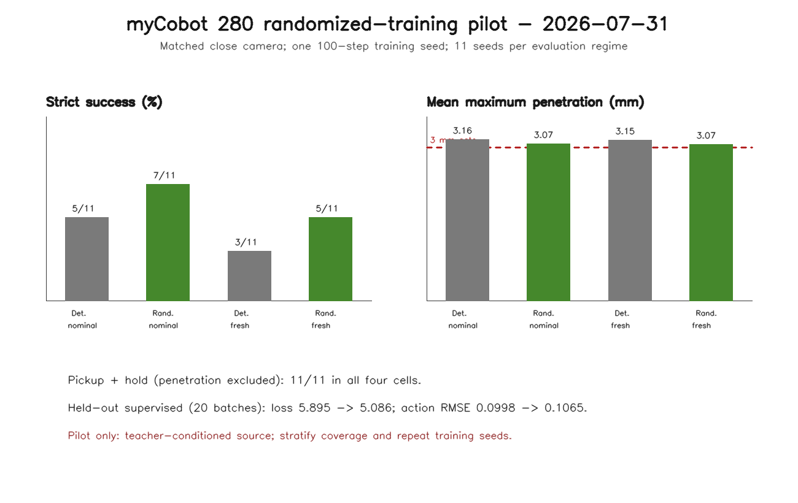

# myCobot 280 Randomized-Training SmolVLA Pilot

**Date:** 2026-07-31 PDT

**Branch:** `codex/mycobot280-randomized-smolvla-eval`

**Parent evidence:**
`docs/research/2026_07_31/mycobot280_camera_ablation_evidence.md`

## Question

Does a 100-step SmolVLA checkpoint trained on the existing audited randomized
close-camera corpus outperform the matched deterministic-close checkpoint in
policy-only closed-loop simulation?

In this one-training-seed pilot, yes:

- nominal fixed physics: randomized-trained `7/11` versus
  deterministic-trained `5/11` strict successes;
- fresh randomized physics: randomized-trained `5/11` versus
  deterministic-trained `3/11` strict successes;
- the randomized-trained checkpoint added two paired successes without losing
  a deterministic-checkpoint success in each regime;
- all 44 policy/regime episodes completed the pickup/contact/hold behavior;
  every strict failure was caused only by the unchanged 3.0 mm maximum
  penetration gate.

This is promising pilot evidence. It is not a publication-level robustness
estimate because there is one policy-training seed and 11 evaluation seeds per
regime. The accepted demonstrations are also teacher-success-conditioned rather
than uniformly distributed over the declared physics ranges.



## Ownership Boundary

This work consumes the randomized-source task's existing corpus and does not
regenerate it or duplicate its source-level QA. This branch owns:

- split-aware LeRobot conversion and native reload validation;
- exact-7D SmolVLA training and checkpointing;
- fresh manifest-driven evaluator randomization;
- matched deterministic/randomized checkpoint evaluation;
- machine-checkable summary, figure, and evidence.

The source-generator branch remains authoritative for rejection sampling,
manifest provenance, split validation, and source camera QA.

## Dataset Contract

Audited source:

```text
_workspace/mycobot_teacher_datasets/mycobot_280_ground_pickup_randomized_v1_50train_10val_allframes_verified_20260731/
```

The consumed corpus contains:

- 50 training and 10 held-out validation episodes;
- 31,800 all-frame 256 x 256 RGB observations;
- close policy camera `ground_pickup_closeup`;
- 73 unique attempted seeds: 60 accepted and 13 rejected;
- no train/validation seed, pose, factor, or trajectory overlap;
- 60 accepted episodes from 73 attempted candidates (82.2% overall);
- cube yaw in `[-0.2, 0.2]` radians;
- cube mass in `[0.028, 0.036]` kg;
- cube friction in `[3.4, 4.0]`;
- fixed pad friction `640.0` and support friction `4.0`;
- randomized-export contact solver `solref=[0.01, 1.0]`;
- no teacher attachment or pickup/lift object teleport.

Source QA reported a minimum sampled red-cube occupancy of 2.571%, zero border
touches, a minimum final lift of 57.13 mm, a minimum post-hold height of
47.67 mm, a 300-step two-pad hold, and maximum penetration of 2.841 mm.

### Source Selection Bias

The merged source checker now reports accepted, rejected, train, and validation
coverage in equal-width factor quartiles. These are advisory diagnostics, not
dataset validity failures.

Yaw is reasonably balanced, but mass is not. All 13 rejected attempts are in
the highest cube-mass quartile, 0.034-0.036 kg. Only 2/15 attempts in that
quartile were accepted (13.3%), and validation contains zero accepted examples
there. Validation also has no accepted examples in the first two cube-friction
quartiles.

Therefore, the training corpus represents demonstrations conditional on this
teacher succeeding. It must not be described as uniform coverage of the full
declared mass/friction range. The fresh randomized evaluator still uses direct,
unfiltered draws across the declared ranges, which makes its result useful as a
stress pilot, but 11 seeds cannot resolve sparse factor cells.

Native LeRobot conversion preserved one camera and exact 7D state/action:

| Split | Episodes | Frames | Native size |
| --- | ---: | ---: | ---: |
| Train | 50 | 26,500 | 747 MB |
| Validation | 10 | 5,300 | 149 MB |

The intermediate adapter directories appear as 5.0 GB and 1,020 MB, but their
images are hard links to the existing source. A sampled intermediate BMP had
link count two, so these directories did not allocate another physical copy of
the image corpus.

## Training

The randomized-close checkpoint used:

- base policy: `lerobot/smolvla_base` from the local cache;
- training data: all 50 randomized training episodes;
- optimizer steps: 100;
- batch size: 1;
- learning rate: `1e-5`;
- Torch seed: `20260731`;
- device: CUDA;
- duration: 172.29 seconds;
- exact 7D state/action processors;
- constant-joint normalization safeguard;
- saved model, optimizer, processor configs, exact-7D contract, log, and
  TensorBoard events.

The reloadable checkpoint occupies about 1.3 GB. Training loss was highly
batch-dependent (`0.6698` first and `1.9501` final, with large intervening
spikes), so no convergence claim is made from the training trace.

## Held-Out Supervised Check

Both policies used the training split's processor statistics and the same first
20 held-out validation batches.

| Policy | Mean loss | Mean postprocessed action RMSE | Step-0 RMSE |
| --- | ---: | ---: | ---: |
| Unfine-tuned base | 5.8947 | 0.09980 | 0.11292 |
| Randomized 100-step | 5.0859 | 0.10652 | 0.11960 |

Fine-tuning reduced supervised loss by 13.7% but increased postprocessed action
RMSE by 6.7%. The disagreement reinforces that neither diagnostic is a task
success proxy; closed-loop simulation is the relevant pilot result.

## Closed-Loop Protocol

Both evaluation regimes use:

- `ground_pickup_closeup` at 256 x 256;
- exact 7D state/action and one image feature;
- 530 policy-controlled MuJoCo steps;
- identical prompt, gravity schedule, scene construction, and verifier;
- no cube pose, contact metrics, or MuJoCo state as policy input;
- no teacher attachment or object teleport;
- an unchanged strict maximum penetration cap of 3.0 mm.

The nominal regime uses fixed physics and seeds 91000-91010 with identical
yaw values for both checkpoints.

The fresh randomized regime uses seeds 92000-92010. It reuses the audited
source manifest's exact PCG64 sampler and ranges, applies the randomized contact
calibration, and draws candidates directly without teacher-success rejection.
The evaluator verifies that these seeds overlap none of the 73 accepted or
rejected source attempts. Both checkpoints received byte-equivalent schedules
and candidate dictionaries.

## Results

| Training data | Evaluation physics | Strict success | Pickup + hold | Mean final lift | Mean max penetration |
| --- | --- | ---: | ---: | ---: | ---: |
| Deterministic close | Nominal fixed | 5/11 | 11/11 | 62.22 mm | 3.157 mm |
| Randomized close | Nominal fixed | 7/11 | 11/11 | 60.48 mm | 3.072 mm |
| Deterministic close | Fresh randomized | 3/11 | 11/11 | 62.84 mm | 3.147 mm |
| Randomized close | Fresh randomized | 5/11 | 11/11 | 61.19 mm | 3.068 mm |

Paired nominal result:

- added strict successes at seeds 91004 and 91006;
- no lost strict successes;
- lower penetration on 9/11 seeds;
- mean maximum penetration reduced by 0.084 mm.

Paired fresh-randomized result:

- added strict successes at seeds 92003 and 92006;
- no lost strict successes;
- lower penetration on 9/11 seeds;
- mean maximum penetration reduced by 0.079 mm.

`Pickup + hold` deliberately excludes the penetration gate while retaining the
50 mm final lift, two final pad contacts, 60-step sustained two-pad lift,
300-step post-lift hold, and 45 mm minimum post-hold lift gates. It is reported
beside strict success rather than replacing it.

## Visual QA

The dated figure was visually inspected and has legible labels, correctly
ordered bars, and a visible 3 mm threshold. Representative step-0 and step-529
frames from both fresh-randomized arms were also inspected. The close camera
makes the cube and gripper readable, and both final frames show the red cube
lifted between the pads. The images agree with the functional pickup/hold
metrics.

## What This Proves

- The audited, teacher-success-conditioned randomized corpus can be converted
  to native LeRobot format and loaded with exact 7D myCobot features.
- A complete randomized-data SmolVLA checkpoint can train, save, and execute in
  closed-loop MuJoCo simulation.
- The evaluator can reproduce the source randomization contract on fresh,
  direct, source-disjoint draws.
- Within this one-seed pilot, randomized-data training adds two paired strict
  successes without losing a success under both nominal and fresh-randomized
  evaluation.
- The randomized checkpoint reduces mean maximum penetration in both matched
  regimes even though its mean final lift is slightly lower.

## What This Does Not Prove

- a statistically reliable randomization benefit across policy-training seeds;
- uniform demonstration coverage across the declared mass/friction ranges;
- learned high-mass robustness, because only two high-mass demonstrations were
  accepted and validation has none;
- convergence or optimality after 100 optimizer steps;
- robustness beyond the narrow yaw, mass, and friction ranges used here;
- robustness to unseen cube size, translation, camera perturbation, clutter, or
  recovery states;
- transfer to a real myCobot 280;
- agentic verifier/retry benefit;
- superiority over SO101, LIBERO, or another model.

## Storage And Safety

Measured after the run:

- native train plus validation: about 896 MB;
- checkpoint including optimizer state: about 1.3 GB;
- supervised and closed-loop evaluation artifacts: 119 MB;
- WSL virtual free space: 804 GB;
- physical Windows `C:` free space: 5,484,634,112 bytes, about 5.11 GiB.

The low physical-host margin remains the real constraint. No additional
storage-heavy training seeds or dataset generations should start until host
space is increased or old artifacts are deliberately archived/pruned.

## Evidence Paths

Committed:

- `configs/mycobot280/training_datasets/ground_pickup_randomized_closecam_v1.json`
- `scripts/evaluate_mycobot280_smolvla_policy.py`
- `scripts/summarize_mycobot280_randomized_training_pilot.py`
- `docs/research/2026_07_31/mycobot280_randomized_training_pilot_summary.json`
- `docs/research/2026_07_31/mycobot280_randomized_training_pilot.png`

Local generated artifacts:

- native data: `_workspace/mycobot280_lerobot/ground_pickup_randomized_closecam_v1_*_native/`
- checkpoint: `_workspace/mycobot280_training/ground_pickup_randomized_closecam_v1_100step_seed20260731/`
- supervised and closed-loop reports: `_workspace/mycobot280_eval/randomized_closecam_pilot_20260731/`

## Recommended Next Step

Open this result as a dependent PR after the camera-ablation PR. The next
highest-value experiment is replication, not a longer single run: use at least
three policy-training seeds for deterministic-close and randomized-close, then
evaluate each on 20-30 matched fresh-randomized seeds. Before that replication,
generate a stratified or deliberately oversampled high-mass source extension
and require accepted validation examples in every mass and friction quartile.
Preserve separate strict and pickup/hold metrics. Wait for materially more
physical host storage before launching those datasets or checkpoints.
