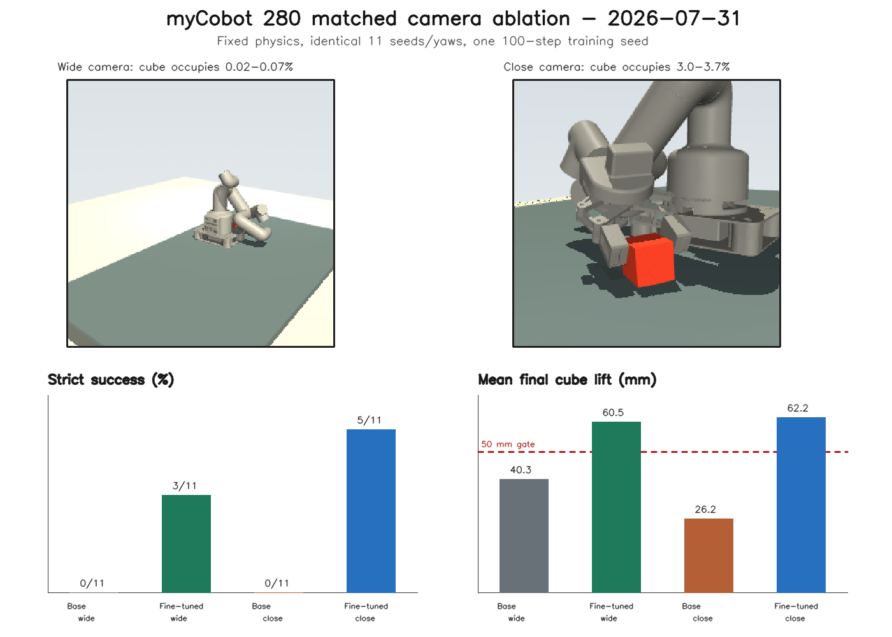
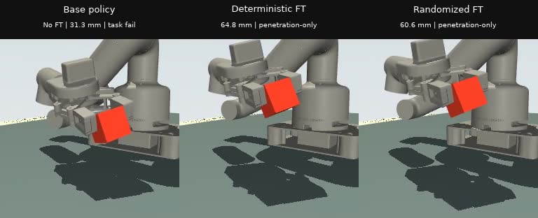

# myCobot 280 SmolVLA Training and Evaluation PR Package

**Prepared:** 2026-08-01 PDT

**Branch:** `codex/mycobot280-randomized-smolvla-eval`

**Suggested PR title:** myCobot 280 SmolVLA randomized-training replication and matched closed-loop evaluation

## PR Summary

This PR turns the myCobot 280 ground-pickup teacher pipeline into a complete
SmolVLA training and policy-only evaluation result. It adds matched close-camera
LeRobot datasets, exact-7D SmolVLA fine-tuning safeguards, reloadable
checkpoints, held-out supervised diagnostics, camera-controlled closed-loop
evaluation, three paired training-seed replications, penetration-failure audit,
figures, and reproducible video capture.

The primary result is directional replication:

- randomized-data fine-tuning improves strict success over deterministic-data
  fine-tuning in 3/3 paired training seeds under nominal fixed physics;
- the same direction holds in 3/3 paired training seeds under fresh randomized
  physics;
- this is replicated engineering evidence, not statistical significance:
  the exact two-sided sign test is `p=0.25` at `n=3`.

Agentic verifier, retry, and intervention code are intentionally excluded from
this PR.

## Dataset Contract

| Input | Episodes | Frames | Camera | Role |
| --- | ---: | ---: | --- | --- |
| Deterministic close-camera train | 50 | 26,500 | `ground_pickup_closeup`, 256 x 256 | deterministic fine-tuning |
| Randomized close-camera train | 50 | 26,500 | `ground_pickup_closeup`, 256 x 256 | randomized fine-tuning |
| Randomized close-camera validation | 10 | 5,300 | same matched camera | common held-out diagnostics |

Both policies therefore receive the same observation resolution, task prompt,
action/state dimensionality, training budget, and evaluation camera.

The randomized source contains 60 accepted episodes from 73 attempted seeded
candidates. It is teacher-success-conditioned rather than uniformly sampled:
all 13 rejected attempts occur in the highest cube-mass quartile
(0.034-0.036 kg), where only 2/15 attempts were accepted. Validation contains no
accepted high-mass examples and no accepted examples in the first two friction
quartiles.

## Training Contract

All six matched checkpoints use:

- base policy `lerobot/smolvla_base`;
- 100 optimizer steps, batch size 1, learning rate `1e-5`;
- CUDA and local model files only;
- exact 7D observation state and exact 7D action;
- saved dataset-derived preprocessor and postprocessor;
- constant-joint normalization safeguard;
- model weights, optimizer state, feature contract, train log, and TensorBoard
  events in every checkpoint.

| Data | Seed | Median batch train loss | Held-out loss, 20 batches | Held-out action RMSE |
| --- | ---: | ---: | ---: | ---: |
| Deterministic | 20260731 | 0.37815 | 4.98985 | 0.10869 |
| Randomized | 20260731 | 0.35483 | 5.08591 | 0.10652 |
| Deterministic | 20260732 | 0.41996 | 4.60799 | 0.10405 |
| Randomized | 20260732 | 0.43502 | 4.73292 | 0.10105 |
| Deterministic | 20260733 | 0.34436 | 5.28494 | 0.11066 |
| Randomized | 20260733 | 0.37761 | 5.41762 | 0.11105 |
| Mean held-out | - | - | 4.9609 vs 5.0788 | 0.10780 vs 0.10621 |

The last row lists deterministic versus randomized means. Batch training losses
are highly stochastic and are descriptive plumbing diagnostics. Held-out loss
and action RMSE also disagree slightly and do not substitute for closed-loop
task success.

## Closed-Loop Results

Every cell uses 11 matched episodes, 530 policy-controlled MuJoCo steps,
the same close camera, no teacher attachment, no object teleport, and an
unchanged 3.0 mm pad-cube penetration cap.

| Training seed | Det. nominal | Rand. nominal | Det. fresh | Rand. fresh |
| ---: | ---: | ---: | ---: | ---: |
| 20260731 | 5/11 | 7/11 | 3/11 | 5/11 |
| 20260732 | 1/11 | 4/11 | 1/11 | 5/11 |
| 20260733 | 0/11 | 3/11 | 0/11 | 4/11 |
| Pooled descriptive total | 6/33 | 14/33 | 4/33 | 14/33 |

Episodes sharing one checkpoint are not independent training replications, so
the pooled row is descriptive. The independent unit for the directional result
is the three paired training seeds.

| Training data | Evaluation physics | Strict | Pickup + hold | Penetration-only |
| --- | --- | ---: | ---: | ---: |
| Deterministic close | Nominal fixed | 6/33 | 32/33 | 26/33 |
| Randomized close | Nominal fixed | 14/33 | 32/33 | 18/33 |
| Deterministic close | Fresh randomized | 4/33 | 32/33 | 28/33 |
| Randomized close | Fresh randomized | 14/33 | 33/33 | 19/33 |

Randomized training lowers mean maximum pad-cube penetration by 0.087 mm under
nominal physics and 0.082 mm under fresh randomized physics.

## No-Fine-Tuning Attribution

On the matched fresh-randomized schedule at training seed `20260731`:

| Policy | Strict | Pickup + hold |
| --- | ---: | ---: |
| Unfine-tuned base | 0/11 | 0/11 |
| Deterministic-close fine-tuned | 3/11 | 11/11 |
| Randomized-close fine-tuned | 5/11 | 11/11 |

An unfine-tuned policy has no deterministic/randomized dataset variant because
it has consumed neither training dataset.

## Camera Ablation

The deterministic one-seed camera ablation compares the same base and
fine-tuned policy under matched fixed physics:

| Policy | Wide strict | Close strict | Wide mean final lift | Close mean final lift |
| --- | ---: | ---: | ---: | ---: |
| Base | 0/11 | 0/11 | 40.3 mm | 26.2 mm |
| Fine-tuned | 3/11 | 5/11 | 60.5 mm | 62.2 mm |

The later deterministic-versus-randomized comparisons use the same close-camera
contract, so camera framing is not confounded with training-data randomization.

## Penetration Failure Boundary

The trace audit covers 143 episodes: 132 fine-tuned rollouts plus the 11-episode
unfine-tuned control.

- 100 episodes cross the 3.0 mm pad-cube penetration cap;
- 91 are penetration-only failures that still pass pickup, lift, contact, and
  hold gates;
- mean peak among crossing episodes is 3.305 mm;
- every audited peak occurs on the right pad during
  `approach_down_to_cube_on_mat`.

The metric covers adaptive-gripper pad versus cube contacts only. It does not
mislabel cube-mat penetration or robot self-collision.

The fixed +5 mm side offset is perpendicular to the jaw axis and cannot explain
right-versus-left pad identity. The experiment also fixes a +1.5 mm jaw-axis
offset. This PR reports the right-pad pattern as a placement/contact-sensitive
signature, not as a pad-specific root-cause result. A centered or explicitly
stratified jaw-axis contract is required before agentic retry calibration.

## Figures

### Matched camera ablation

### One-seed randomized-training pilot

### Three-seed randomized-training replication

All three figures were visually inspected. Titles, legends, labels, annotations,
and caveat text are readable, and no elements overlap.

## Video Evidence

[Open the 17.67-second matched comparison MP4](mycobot280_base_vs_finetuned_seed92000.mp4)

The video uses fresh randomized candidate seed `92000`, training seed
`20260731`, and the same camera and physics for all three policies.

| Policy | Final lift | Max penetration | Outcome |
| --- | ---: | ---: | --- |
| Base, no fine-tuning | 31.30 mm | 3.292 mm | task failure plus penetration |
| Deterministic fine-tuning | 64.83 mm | 3.178 mm | pickup/hold; penetration-only |
| Randomized fine-tuning | 60.61 mm | 3.113 mm | pickup/hold; penetration-only |

This seed illustrates the base-versus-fine-tuned behavioral change. It does not
by itself demonstrate randomized-training superiority because both fine-tuned
policies are penetration-only near-successes on this candidate. The aggregate
and three-seed figures carry that comparison.

Each source video is 256 x 256, 30 FPS, 530 frames, and 17.67 seconds. The
committed composite is 768 x 312 and 1.15 MB. Media reruns match the original
saved candidate dictionaries and key outcome fields exactly for all three
policies.
The uncommitted source videos and their evaluation reports remain under
`_workspace/mycobot280_eval/pr_media_20260801/`.

## Machine-Readable Evidence

- [Multiseed summary JSON](../2026_07_31/mycobot280_randomized_training_multiseed_summary.json)
- [Pilot summary JSON](../2026_07_31/mycobot280_randomized_training_pilot_summary.json)
- [Penetration audit JSON](../2026_07_31/mycobot280_penetration_failure_audit.json)
- [Multiseed evidence](../2026_07_31/mycobot280_randomized_training_multiseed_evidence.md)
- [Camera-ablation evidence](../2026_07_31/mycobot280_camera_ablation_evidence.md)
- [Randomized-source audit](../mycobot_280_randomized_ground_pickup_source_audit_2026_07_31.md)

## Verification

- `28` focused `test_mycobot280_*.py` tests pass.
- `13` randomized-source contract tests pass.
- The regenerated multiseed JSON matches the committed summary byte-for-byte.
- The regenerated penetration audit passes over all 143 saved traces.
- All four MP4 files decode to exactly 530 frames at 30 FPS.
- The comparison video was visually inspected at lift and end-of-hold frames.
- `git diff --check` passes before commit.

## Claim Boundary

This PR proves that the exact-7D training, checkpoint reload, held-out
diagnostic, and policy-only closed-loop pipeline works across three paired
training seeds, and that randomized-data training improves strict success in
the tested direction in all three pairs.

It does not prove statistical significance, uniform physics coverage, optimized
training convergence, real-robot transfer, recovery from unseen states, or
agentic verifier/retry benefit.
