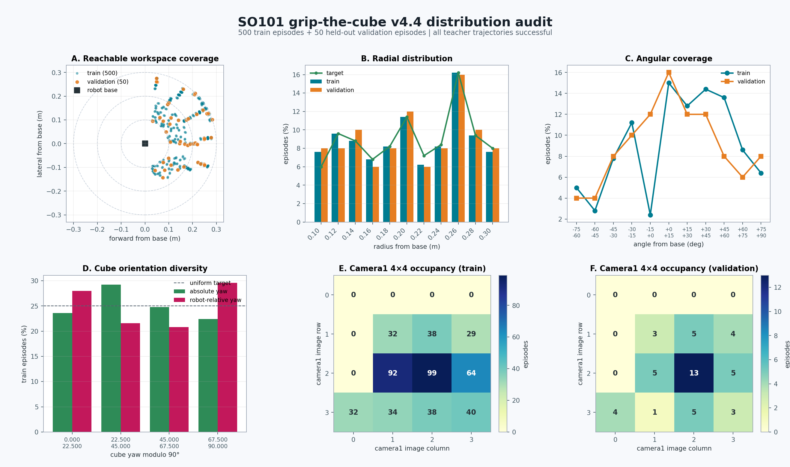

# SO101 `grip_the_cube_v4_4` Distribution Report

Date: 2026-08-02

## Verdict

The `grip_the_cube_v4_4` train and validation splits pass their declared
distribution gates. The dataset covers the feasible forward workspace from
approximately 0.10 m to 0.30 m, spans about 150 degrees around the robot, and
contains all four absolute and robot-relative cube-yaw strata. Every exported
teacher trajectory succeeds and every episode has a unique seed and workspace
position.

The distribution is not uniform in camera1 image space. Bins 9 and 10 are the
largest bins, while the top row and most of the left column are unreachable or
not visible under the fixed camera and robot geometry. This is not a radial
collapse: the workspace plot and radius histogram show near, middle, and far
placements. Training should continue to use the camera-grid balanced sampler
when batches need equal visual-position exposure.

## Split Summary

| Metric | Train | Validation |
|---|---:|---:|
| Episodes | 500 | 50 |
| Frames | 94,775 | 9,474 |
| Teacher success | 100.0% | 100.0% |
| Unique seeds | 500 | 50 |
| Unique workspace positions | 500 | 50 |
| Radius span | 0.2009 m | 0.1991 m |
| Placement-angle span | 154.18 deg | 149.40 deg |
| Radial total variation from target | 0.016 | 0.020 |
| Polar-cell coverage | 88.0% | 80.0% |
| Polar-cell count CV | 0.644 | 0.775 |
| Absolute yaw coverage | 100.0% | 100.0% |
| Absolute yaw count CV | 0.103 | 0.382 |
| Robot-relative yaw coverage | 100.0% | 100.0% |
| Robot-relative yaw count CV | 0.154 | 0.332 |
| Camera1 invisible | 2 (0.4%) | 2 (4.0%) |
| Invisible in both policy cameras | 0 | 0 |
| Median nearest-neighbor distance | 1.76 mm | 11.88 mm |

The larger validation CV values are expected from a 50-episode held-out split.
All validation yaw bins remain occupied, and the radial distribution remains
within 0.02 total variation of its target quota.

## Radial Distribution

| Radius from base | Train | Validation | Train target |
|---:|---:|---:|---:|
| 0.10 m | 38 | 4 | 30 |
| 0.12 m | 48 | 4 | 48 |
| 0.14 m | 44 | 5 | 44 |
| 0.16 m | 34 | 3 | 34 |
| 0.18 m | 41 | 4 | 41 |
| 0.20 m | 57 | 6 | 57 |
| 0.22 m | 31 | 3 | 36 |
| 0.24 m | 41 | 4 | 42 |
| 0.26 m | 81 | 8 | 81 |
| 0.28 m | 47 | 5 | 47 |
| 0.30 m | 38 | 4 | 40 |

The 0.26 m peak is intentional and matches the feasible-workspace target. It
is not evidence that all objects are at the same distance.

## Cube Orientation

| Yaw modulo 90 deg | Absolute train | Robot-relative train | Absolute validation | Robot-relative validation |
|---:|---:|---:|---:|---:|
| 0.0 to 22.5 | 118 | 140 | 15 | 17 |
| 22.5 to 45.0 | 146 | 108 | 19 | 10 |
| 45.0 to 67.5 | 124 | 104 | 7 | 7 |
| 67.5 to 90.0 | 112 | 148 | 9 | 16 |

Robot-relative yaw is measured as `(cube_yaw - spawn_angle) mod 90 deg`. Its
full coverage verifies that the same cube face is not always presented to the
robot.

## Camera1 Grid Occupancy

The tables use image row-major order. Counts sum to 498 train and 48 validation
episodes because two episodes in each split are camera1-invisible while still
visible to camera2.

| Train row | Column 0 | Column 1 | Column 2 | Column 3 |
|---:|---:|---:|---:|---:|
| 0 | 0 | 0 | 0 | 0 |
| 1 | 0 | 32 | 38 | 29 |
| 2 | 0 | 92 | 99 | 64 |
| 3 | 32 | 34 | 38 | 40 |

| Validation row | Column 0 | Column 1 | Column 2 | Column 3 |
|---:|---:|---:|---:|---:|
| 0 | 0 | 0 | 0 | 0 |
| 1 | 0 | 3 | 5 | 4 |
| 2 | 0 | 5 | 13 | 5 |
| 3 | 4 | 1 | 5 | 3 |

## Primitive Materializations

The parent dataset owns the single end-to-end closed-loop test. Primitive
datasets are supervision slices only and do not carry phase-specific loop
tests.

| Primitive | Train episodes | Train frames | Validation episodes | Validation frames | Loop test |
|---|---:|---:|---:|---:|---|
| `move` | 500 | 31,502 | 50 | 3,104 | none |
| `align` | 800 | 47,498 | 50 | 2,096 | none |
| `grip_lift` | 800 | 68,415 | 50 | 4,274 | none |
| parent `grip_the_cube_v4_4` | 500 | 94,775 | 50 | 9,474 | 10 episode end-to-end |

`align` and `grip_lift` include the additional 300 near-target alignment
trajectories from `grip_the_cube_v4_4_at`. `move` preserves natural rough
alignment during motion but does not consume the near-target-only split.

## Reproducibility Inputs

- Recipe: `configs/so101/dataset_generation/grip_the_cube_v4_4.json`
- Train statistics: `_workspace/so101_lerobot/grip_the_cube_v4_4/meta/distribution/distribution.json`
- Validation statistics: `_workspace/so101_lerobot/grip_the_cube_v4_4_validation/meta/distribution/distribution.json`
- Parent loop start: `_workspace/so101_lerobot/grip_the_cube_v4_4_validation/meta/closed_loop/grip_the_cube_v4_4_validation_start10.json`
- Distribution builder: `scripts/build_so101_dataset_distribution_report.py`

All declared distribution checks pass for both splits. The checked-in figure
is a review visualization derived from the canonical JSON reports; the JSON
reports remain the machine-authoritative evidence.
